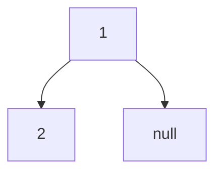
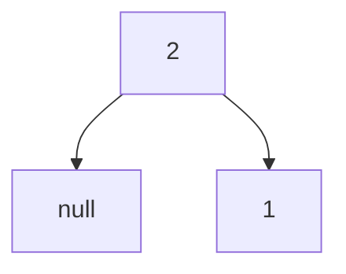

## 二、异或

- 异或：相同为0，不相同为1
- 可以理解为无进位相加
-  0 ^ N = N, N ^ N = 0,  a ^ b = b ^ a,  a ^ b ^  c = a ^ (b ^ c)

### 1、不用额外变量交换两个数

- a = a ^ b
- b = a ^ b = (a ^ b) ^ b = a
- a = a ^ b = (a ^ b) ^ (a) = b  
- 连续异或三次即可（注意数组相同位置不能采用这种方式交换元素，如果位置相同第一次异或就会把原位置变为0，后续结果全为0）
- 异或运算效率较高

```java
/**
 * @author duwei
 * @version 1.0.0
 * @create 2022-05-22 20:23
 * @description 不使用额外变量交换两个数，要保证数组交换元素时上游调用不是同一位置
 */
public class Swap {
    public static void main(String[] args) {
        int a = 10;
        int b = 20;
        a = a ^ b;
        b = a ^ b;
        a = a ^ b;
        System.out.format("a = %d,b = %d",a,b);
    }
}

```

### 2、找出数组中出现了奇数次的元素（其余都偶数次）,时间复杂度$$O(N)$$，空间复杂度$$O(1)$$

- 全部异或即可，偶数次的元素会两两异或为0

```java
/**
 * @author duwei
 * @version 1.0.0
 * @create 2022-05-22 20:31
 * @description 找出数组中出现了奇数次的元素（其余都偶数次）
 */
public class Code01_EvenTimesOddTimes {

    /**
     * 打印数组中出现次数为奇数次的元素，数组为null返回系统最大
     * @param arr
     * @return
     */
    public static int printOddTimesNum(int[] arr){
        if (arr == null || arr.length == 0){
            return Integer.MAX_VALUE;
        }

        int eor = 0;
        for (int num : arr){
            eor ^= num;
        }
        return eor;
    }
}
```

### 3、一个数组中两个数出现了奇数次，其余出现了偶数次，找到这两个数，时间复杂度$$O(N)$$，空间复杂度$$O(1)$$

- 首先将全部元素异或一次，即结果为a ^ b
- 找到a ^ b 结果中最右侧的1，即a 或 b在这一位不同（只要a 和 b在该位不同即可，拿哪一位的1就行）
- 用这个1将所有元素分为两类，即该位为1和该位不为1
- 然后将分成的两类分别异或就可得到结果

```java
/**
 * @author duwei
 * @version 1.0.0
 * @create 2022-05-22 20:54
 * @description 一个数组中两个数出现了奇数次，其余出现了偶数次，找到这两个数
 */
public class Code02_EvenTimesTwoOddTimes {
    public static int[] printTwoOddTimesNum(int[] arr){
        int eor = 0;
        for (int num : arr){
            eor ^= num;
        }

        //找到分割不同数最右边的1
        int right = eor & (~eor + 1);

        int one = 0;
        for (int num : arr){
            if ((num & right) != 0){
                one ^= num;
            }
        }

        int two = one ^ eor;
        return new int[]{one,two};
    }
}
```

### 4、一个数组中一种数出现了K次，其他都出现了M次，其中$$K < M且 M > 1$$，要求额外空间复杂度$$O(1)$$，即不能使用Hash表，时间复杂度$$O(N)$$

- int类型可以用32位比特表式，准备一个32长度的数组，分别储存所有数字第i位1出现次数
- 那么数组中元素最终只有3种结果，0、p * M（p位一个常数）、p * M + K
- 遍历数组对每个元素取余，不为0的话就说明出现K次的数在该位为1，记录下来即可

```java
/**
 * @author duwei
 * @version 1.0.0
 * @create 2022-05-22 20:44
 * @description TODO
 */
public class Code03_KM {
    /**
     * 找出数组种出现k次的那个元素,采用int[]32位数组实现，空间复杂度O(1)
     * @param arr
     * @param k
     * @param m
     * @return
     */
    public static int onlyKTimes(int[] arr, int k, int m) {
        int[] counts = new int[32];

        //统计所有数字对应bit位的次数
        for (int num : arr) {
            for (int i = 0; i < 32; i++) {
                counts[i] += (num >> i) & 1;
            }
        }

        //遍历数组找到出现k次的元素
        int result = 0;
        for (int i = 0; i < 32; i++) {
            if ((counts[i] % m) != 0) {
                result |= (1 << i);
            }
        }

        return result;
    }

    /**
     * 采用HashMap找到出现k次的数
     * @param arr
     * @param k
     * @param m
     * @return
     */
    public static int onlyKTimesByHashMap(int[] arr,int k,int m){
        HashMap<Integer, Integer> map = new HashMap<>();
        for (int num : arr){
            if (!map.containsKey(num)){
                map.put(num,0);
            }
            map.put(num,map.get(num) + 1);
        }

        for (int num : map.keySet()){
            if (map.get(num) == k){
                return num;
            }
        }
        return 0;

    }

    /**
     * 返回满足要求的数组
     *
     * @param maxKinds 一共多少种数的范围
     * @param range    数字的范围
     * @param k        出现k次
     * @param m        出现m次
     * @return
     */
    public static int[] randomArray(int maxKinds, int range, int k, int m) {
        //1.出现k次的数字
        int kTimesNum = randomNumber(range);

        //2.一共多少种数,至少需要两种
        int numKinds = (int) ((Math.random() * maxKinds) + 2);

        //3.数组的长度
        int[] arr = new int[k + m * (numKinds - 1)];

        //4.填充出现k次的数
        int index = 0;
        for (; index < k; index++) {
            arr[index] = kTimesNum;
        }

        //5.填充剩余的数字
        numKinds--;
        HashSet<Integer> set = new HashSet<>();
        set.add(kTimesNum);

        while (numKinds != 0) {
            int curNum = 0;
            //保证随机的数字没有出现过
            do {
                curNum = randomNumber(range);
            } while (set.contains(curNum));
            set.add(curNum);
            //剩余待填的种类的数减1
            numKinds--;

            //填充剩余的数字
            for (int i = 0; i < m; i++) {
                arr[index++] = curNum;
            }
        }
        return arr;

    }

    /**
     * 返回[-range,range]范围内的随机整数
     *
     * @param range
     * @return
     */
    public static int randomNumber(int range) {
        return (int) (Math.random() * (range + 1)) - (int) (Math.random() * (range + 1));
    }

    public static void main(String[] args) {
        int kinds = 50;
        int range = 300;
        int testTimes = 10000;
        int max = 9;
        System.out.println("测试开始");
        for (int i = 0; i < testTimes; i++) {
            int a = (int) (Math.random() * max) + 1;  //1 ~ 9
            int b = (int) (Math.random() * max) + 1;  //1 ~ 9
            int k = Math.min(a, b);
            int m = Math.max(a, b);
            if (k == m) {
                m++;
            }
            int[] arr = randomArray(kinds,range,k,m);
            int resultOne = onlyKTimes(arr, k, m);
            int resultTwo = onlyKTimesByHashMap(arr, k, m);
            if (resultOne != resultTwo){
                System.out.println("出错了");
                return;
            }
        }
        System.out.println("测试结束");
    }
}
```

## 三、一些基础数据结构（链表、Master公式、堆、栈、哈希表）

### 1、反转单链表和双链表，空间复杂度$$O(1)$$

- 使用容器，空间复杂度$$O(N)$$，效率太低
- 使用额外几个变量，完成链表反转。反转时候只关注当前节点

```java
/**
 * @author duwei
 * @version 1.0.0
 * @create 2022-05-23 10:47
 * @description 单链表
 */
public class Node<T> {
    public T value;
    public Node<T> next;

    public Node(T value) {
        this.value = value;
    }
}

/**
 * @author duwei
 * @version 1.0.0
 * @create 2022-05-23 10:50
 * @description 双链表
 */
public class DoubleNode<T> {
    public T value;
    public DoubleNode<T> last;
    public DoubleNode<T> next;

    public DoubleNode(T value) {
        this.value = value;
    }
}


/**
 * @author duwei
 * @version 1.0.0
 * @create 2022-05-23 10:52
 * @description 反转链表
 */
public class Code01_ReverseList {

    /**
     * 打印单链表
     * @param head
     * @param <T>
     */
    public static <T> void printLinkedList(Node<T> head){
        while (head != null){
            System.out.print(head.value + " ->");
            head = head.next;
        }
        System.out.println();
    }


    /**
     * 打印双链表
     * @param head
     * @param <T>
     */
    public static <T> void printDoubleList(DoubleNode<T> head){
        while (head != null){
            System.out.print(head.value + " ->");
            head = head.next;
        }
        System.out.println();
    }

    /**
     * 反转单链表,迭代方式，循环遍历链表节点,不用额外空间
     * @param head  原链表头节点
     * @param <T>   泛型
     * @return      反转过后的头节点
     */
    public static <T> Node<T> reverseLinkedList(Node<T> head){
        if (head == null){
            return head;
        }
        //记录反转链表的头节点
        Node<T> pre = null;
        //当前节点的下一个节点
        Node<T> next = null;
        Node<T> cur = head;
        while (cur != null){
            next = cur.next;
            cur.next = pre;
            pre = cur;
            cur = next;
        }
        return pre;
    }

    /**
     * 反转单链表,迭代方式，循环遍历链表节点,不用额外空间
     * head在迭代中为当前节点，只需要考虑当前节点的调整情况
     * @param head  原链表头节点
     * @param <T>   泛型
     * @return      反转过后的头节点
     */
    public static <T> DoubleNode<T> reverseDoubleList(DoubleNode<T> head){
        if (head == null){
            return head;
        }

        DoubleNode<T> pre = null;
        DoubleNode<T> next = null;
        DoubleNode<T> cur = head;
        while (cur != null){
            next = cur.next;
            cur.next = pre;
            cur.last = next;
            pre = cur;
            cur = next;
        }
        return pre;
    }

    /**
     * 采用容器方法反转单链表
     * @param head
     * @param <T>
     * @return
     */
    public static <T>  Node<T> reverseLinkedListByArray(Node<T> head){
        if (head == null){
            return head;
        }
        List<Node<T>> nodes = new ArrayList<>();
        while (head != null){
            nodes.add(head);
            head = head.next;
            System.out.println("haha");
        }
        System.out.println(nodes.size());
        for (int i = nodes.size() - 1;i > 0;i--){
            nodes.get(i).next = nodes.get(i - 1);
        }
        System.out.println(nodes.size());
        nodes.get(0).next = null;
        return nodes.get(nodes.size() - 1);
    }

    /**
     * 随机生成单链表
     * @param len   链表的最大长度
     * @param value 链表的最大值[1,value]
     * @return
     */
    public static  Node<Integer> generateRandomLinkedList(int len,int value){
        int size = (int) (Math.random() * (len + 1));
        Node<Integer> head = new Node((int)(Math.random()*(value + 1)));
        Node<Integer> pre = head;
        size--;
        while (size-- > 0){
            Node<Integer> cur = new Node((int)(Math.random()*(value + 1)));
            pre.next = cur;
            pre = cur;
        }
        return head;
    }

    /**
     * 随机生成双链表
     * @param len   链表的最大长度
     * @param value 链表的最大值[1,value]
     * @return
     */
    public static  DoubleNode<Integer> generateRandomDoubleList(int len,int value){
        int size = (int) (Math.random() * (len + 1));
        DoubleNode<Integer> head = new DoubleNode((int)(Math.random()*(value + 1)));
        DoubleNode<Integer> pre = head;
        size--;
        while (size-- > 0){
            DoubleNode<Integer> cur = new DoubleNode(((int)(Math.random()*(value + 1))));
            pre.next = cur;
            cur.last = pre;
            pre = cur;
        }
        return head;
    }

    public static void main(String[] args) {
        Node<Integer> randomLinkedList = generateRandomLinkedList(20, 100);
        DoubleNode<Integer> generateRandomDoubleList = generateRandomDoubleList(20, 100);

        printLinkedList(randomLinkedList);
        Node<Integer> integerNode = reverseLinkedList(randomLinkedList);
        printLinkedList(integerNode);

        printDoubleList(generateRandomDoubleList);
        DoubleNode<Integer> doubleNode = reverseDoubleList(generateRandomDoubleList);
        printDoubleList(doubleNode);
    }
}

```

### 2、删除链表给定的元素(有一定编码技巧)

- 函数必须有一个返回值，返回删除后新的头部，因为有可能删除头节点

- 首先找到第一个不需要删除的节点

```java
public class Code02_DeleteGivenValue {
    /**
     * 删除链表给定的值
     * @param head 
     * @param value
     * @param <T>
     * @return
     */
    public static <T> Node<T> removeValue(Node head,T value){
        //head来到第一个不需要删除的位置
        while (head != null){
            if (head.value != value){
               break;
            }
            head = head.next;
        }
        
        Node<T> pre = head;
        Node<T> cur = head;
        while (cur != null){
            if (cur.value == value){
                pre.next = cur.next;
            }else {
                pre = cur;
            }
            cur = cur.next;
        }
        return head;
    }
}

```

### 3、数组实现队列、栈，由双向链表实现双端队列

```java
/**
 * @author duwei
 * @version 1.0.0
 * @create 2022-05-23 12:43
 * @description 双向链表实现队列和栈
 */
public class DoubleEndsQueueToStackAndQueue {
    /**
     * 由双向链表实现双端队列
     * @param <T>
     */
    public static class DoubleEndsQueue<T> {
        public DoubleNode<T> head;
        public DoubleNode<T> tail;

        /**
         * 从队列头加入元素
         *
         * @param value
         */
        public void addFromHead(T value) {
            DoubleNode<T> cur = new DoubleNode<>(value);
            if (head == null) {
                head = cur;
                tail = cur;
            } else {
                cur.next = head;
                head.last = cur;
                head = cur;
            }
        }

        /**
         * 从队列尾部加入元素
         *
         * @param value
         */
        public void addFromTail(T value) {
            DoubleNode<T> cur = new DoubleNode<>(value);
            if (tail == null) {
                head = cur;
                tail = cur;
            } else {
                cur.last = tail;
                tail.next = cur;
                tail = cur;
            }
        }

        /**
         * 从队列头部弹出元素，没有元素抛出异常
         * @return
         */
        public T popFromHead() throws Exception {
            if (head == null) {
                throw new Exception("链表为空");
            }

            DoubleNode<T> cur = head;
           if (head == tail){
               head = null;
               tail = null;
           }else {
               head = head.next;
               cur.next = null;
               head.last = null;
           }
           return cur.value;
        }

        /**
         * 从队列尾部弹出元素，没有元素抛出异常
         * @return
         */
        public T popFromTail() throws Exception {
            if (tail == null){
                throw new Exception("链表为空");
            }

            DoubleNode<T> cur = tail;
            if (tail == head){
                tail = null;
                head = null;
            }else {
                tail = tail.last;
                tail.next = null;
                cur.last = null;
            }
            return cur.value;
        }

        /**
         * 判断双双端队列是否为null
         * @return
         */
        public boolean isEmpty(){
            return head ==  null;
        }
    }

    /**
     * 由数组实现栈
     */
    public static class ArrayToStack{
        public final int limit;
        public int top;
        public int[] data;

        public ArrayToStack(int limit) {
            this.limit = limit;
            top = 0;
            data = new int[limit];
        }

        /**
         * 元素入栈，满抛出异常
         * @param value
         */
        public void push(int value) {
            if (top == limit){
                throw new RuntimeException("当前栈已满");
            }
            data[top++] = value;
        }

        /**
         * 元素出栈，栈空则抛出异常
         * @return
         */
        public int pop()   {
            if (top == 0){
                throw new RuntimeException("当前栈为空");
            }
            return data[--top];
        }

        /**
         * 当前栈是否为空
         * @return
         */
        public boolean isEmpty(){
            return top == 0;
        }

        /**
         * 返回当前栈元素个数
         * @return
         */
        public int size(){
            return top;
        }
    }

    /**
     * 循环数组数组实现队列
     */
    public static class ArrayToQueue{
        public final int limit;
        public int pushIndex;
        public int popIndex;
        public int[] data;
        public int size;

        public ArrayToQueue(int limit) {
            this.limit = limit;
            popIndex = 0;
            pushIndex = 0;
            size = 0;
            data = new int[limit];
        }


        /**
         * 元素入队列
         * @param value
         */
        public void add(int value){
            if (isFull()){
                throw new RuntimeException("队列已满");
            }
            data[pushIndex++] = value;
            pushIndex %= limit;
            size++;
        }

        /**
         * 元素出队列
         * @return
         */
        public int offer(){
            if (isEmpty()){
                throw new RuntimeException("队列为空");
            }
            int value = data[popIndex++];
            popIndex %= limit;
            size--;
            return value;
        }

        /**
         * 判断队列是否为空
         * @return
         */
        public boolean isEmpty(){
            return size == 0;
        }

        /**
         * 判断队列是否已满
         * @return
         */
        public boolean isFull(){
            return size == limit;
        }
    }

}

```

### 4、最小栈,getMin()方法时间复杂度$$O(1)$$

- 实现一个特殊的栈，在基本功能的基础上，再实现返回栈中最小元素的操作，要求

1. pop、push、getMin、操作的时间复杂度都是$$O(1)$$

2. 设置栈类型可以选用已有的栈结构


- 做法：使用两个栈，一个正常存取元素，一个只存储当前时刻栈的最小元素

```java
/**
 * @author duwei
 * @version 1.0.0
 * @create 2022-05-23 22:13
 * @description 最小栈
 */
public class Code05_MinStack {
    public static class MinStack{
        private Stack<Integer> stack;
        private Stack<Integer> minStack;

        public MinStack() {
            stack = new Stack<>();
            minStack = new Stack<>();
        }

        /**
         *返回当前栈的最小元素
         * @return
         */
        public int getMin(){
            return minStack.peek();
        }

        public void push(int value){
            if (stack.empty()){
                minStack.push(value);
            }else {
                if (value < getMin()){
                    minStack.push(value);
                }else {
                    minStack.push(getMin());
                }
            }
            stack.push(value);
        }

        /**
         * 弹出栈当前元素
         * @return
         */
        public int pop(){
            minStack.pop();
            return stack.pop();
        }

        /**
         * 得到当前栈的大小
         * @return
         */
        public int size(){
            return stack.size();
        }
    }
}

```

### 5、使用两个队列实现栈并且使用两个栈实现队列

- 注意一些编码技巧

```java
package class03;

import java.util.LinkedList;
import java.util.Queue;
import java.util.Stack;

/**
 * @author duwei
 * @version 1.0.0
 * @create 2022-05-23 22:20
 * @description TODO
 */
public class Code06_QueueToStackAndStackToQueue {
    /**
     * 使用两个队列实现一个栈
     */
    public static class QueueToStack {
        private Queue<Integer> queue;
        private Queue<Integer> help;

        public QueueToStack() {
            queue = new LinkedList<>();
            help = new LinkedList<>();
        }

        /**
         * 元素出栈
         */
        public int pop() {
            return queue.poll();
        }

        /**
         * 元素入栈
         * @param value
         */
        public void push(int value) {
            help.add(value);
            while (!queue.isEmpty()) {
                help.add(queue.poll());
            }
            Queue<Integer> temp = help;
            help = queue;
            queue = temp;
        }
    }

    
    /**
     * 使用两个栈实现一个队列
     */
    public static class StackToQueue{
        private Stack<Integer> pushStack;
        private Stack<Integer> popStack;

        public StackToQueue() {
            pushStack = new Stack<>();
            popStack = new Stack<>();
        }

        /**
         * 元素出队列操作
         * @return
         */
        public int poll(){
            if (popStack.isEmpty()){
                while (!pushStack.isEmpty()){
                    popStack.push(pushStack.pop());
                }
            }
            return popStack.pop();
        }

        /**
         * 元素入队列操作
         * @param value
         */
        public void add(int value){
            pushStack.add(value);
        }
    }
}

```

### 6、Master公式（分析递归函数时间复杂度,子问题规模必须一样）

- 假设递归可以写成$$T(N) = a*T(\frac {N} b)+O(N^d)$$（其中$$a、b、d$$都为常数）

1. 若$$log_ba < d$$，复杂度为$$O(N^d)$$
2. 若$$log_ba > d$$，复杂度为$$O(N*log_ba)$$
3. 若$$log_ba = d$$，复杂度为$$O(N^d*logN)$$

### 7、哈希表和有序表（使用时需要注意的点）

1. Hash表（HashMap）

- HashMap增删改查都是$$O(1)$$常数时间的，不过这个常数时间有点大
- Hash表内部的存储空间：如果为常数类型（包括String）则开辟空间为对应数据类型的空间大小；如果为引用，则存的是引用地址（8个字节）
- HashMap对于String和包装类型在Hash表中按值传递（equals方法）

2. 有序表（TreeMap、包括红黑树[Java有序表的实现]、AVL树、SB树）

- TreeMap增删改查都是$$O(logN)$$的
- 不会村同样的Key，Key值按一定的规则进行排序

## 四、归并排序时间$$O(N*logN)$$，空间$$O(N)$$

### 1、归并排序递归和迭代版本（需要注意一些边界条件，理解好迭代版本代码）

```java
package class04;

import java.util.Arrays;

/**
 * @author duwei
 * @version 1.0.0
 * @create 2022-05-24 21:01
 * @description 归并排序
 */
public class Code01_MergeSort {

    /**
     * 归并排序递归版本
     *
     * @param arr
     */
    public static void sort(int[] arr) {
        if (arr == null || arr.length == 0) {
            return;
        }
        mergeSort(arr, 0, arr.length - 1);
    }

    /**
     * 递归归并排序
     *
     * @param arr
     * @param L
     * @param R
     */
    private static void mergeSort(int[] arr, int L, int R) {
        //注意，如果写L==R数组长度不能为0
        //否则，就要写成L >= R
        if (L == R) {
            return;
        }
        int mid = L + ((R - L) >> 1);
        //对左边排序
        mergeSort(arr, L, mid);
        //对右边排序
        mergeSort(arr, mid + 1, R);
        //归并
        merge(arr, L, mid, R);
    }

    /**
     * 归并过程，不是递归
     *
     * @param arr
     * @param L
     * @param R
     * @param mid
     */
    private static void merge(int[] arr, int L, int mid, int R) {
        int[] help = new int[R - L + 1];
        //存储新数组的下标
        int k = 0;
        //mid是左边结束的位置
        int l = L;
        int r = mid + 1;
        while (l <= mid && r <= R) {
            if (arr[l] <= arr[r]) {
                help[k++] = arr[l++];
            } else {
                help[k++] = arr[r++];
            }
        }
        //左边没有放完
        while (l <= mid) {
            help[k++] = arr[l++];
        }
        //右边没有放完
        while (r <= R) {
            help[k++] = arr[r++];
        }
        //将排序好的数组返回原数组
        for (int i = 0; i < help.length; i++) {
            arr[L + i] = help[i];
        }
    }

    /**
     * 生成随机长度数组
     *
     * @param maxVale
     * @param maxLen
     * @return
     */
    private static int[] generateRandomArray(int maxVale, int maxLen) {
        int len = (int) (Math.random() * (maxLen + 1));
        int[] arr = new int[len];
        for (int i = 0; i < len; i++) {
            arr[i] = randomNumber(maxVale);
        }
        return arr;
    }

    /**
     * 返回[-max,max]中随机一个元素
     *
     * @param maxValue
     * @return
     */
    private static int randomNumber(int maxValue) {
        return (int) (Math.random() * (maxValue + 1)) - (int) (Math.random() * (maxValue + 1));
    }

    /**
     * 迭代版本归并排序
     * 每次原则一个步长，从1开始(步长代表一个左组或右组的长度)
     */
    public static void sortNonRecursive(int[] arr) {
        if (arr == null || arr.length < 2) {
            return;
        }
        int N = arr.length;
        int mergeSize = 1;
        while (mergeSize < N) {
            //代表每每次调整补偿左边最开始的位置
            int L = 0;
            while (L < N) {
                //左组为[L,M]
                int M = L + mergeSize - 1;
                //左组都不够了，直接跳出本次merge，开始下一轮，必要的一行代码
                if (M > N - 1){
                    break;
                }
                //右组边界
                int R = Math.min(N - 1, M + mergeSize);
                //归并
                merge(arr, L, M, R);
                //下一个左组长度
                L = R + 1;
            }
            //防止Integer.MAX_VALUE溢出，不影响结果
            if (mergeSize > N / 2) {
                break;
            }
            //每次步长加倍
            mergeSize <<= 1;
        }
    }

    public static void main(String[] args) {
        int maxValue = 30;
        int maxLen = 10;
        int times = 10000;
        System.out.println("测试开始");
        for (int i = 0; i < times; i++) {
            int[] arrOriginal = generateRandomArray(maxValue, maxLen);
            int[] arrCopyOne = new int[arrOriginal.length];
            int[] arrCopyTwo = new int[arrOriginal.length];
            System.arraycopy(arrOriginal, 0, arrCopyOne, 0, arrOriginal.length);
            System.arraycopy(arrOriginal, 0, arrCopyTwo, 0, arrOriginal.length);
            Arrays.sort(arrOriginal);
            sort(arrCopyOne);
            sortNonRecursive(arrCopyTwo);
            if (!Arrays.equals(arrCopyOne, arrOriginal) || !Arrays.equals(arrCopyTwo,arrOriginal)) {
                System.out.println("出错了...");
                System.exit(1);
            }
        }
        System.out.println("测试结束");
    }

}

```

### 2、小和问题$$O(N*logN)$$

1. 问题描述：数组中所有元素左边比它小的元素个数累加起来叫做数组的小和
2. 问题求解：

- 常规二次循环即可,$$O(N^2)$$

- 每次在归并的过程中，只要左边当前位置的元素的比右边前位置的元素小，那么左边的这个数就会对右边部分 当前位置向右的所有数产生小和，那么记录右边数组到右边当前的位置之差乘上左边部分当前的值，就是在这次归并中左边该数产生的小和。因为每次都是局部归并，小和每次归并只对右边部分产生，但是归并会两两合并，小归并到大归并，那么在往顶部的归并中产生的所有小和都会被统计起来。因为每次只比较左右两部分，所有在前一次归并中右边部分的小和不会再被记录。$$O(N*logN)$$

  ```java
  /**
   * @author duwei
   * @version 1.0.0
   * @create 2022-05-25 21:39
   * @description 求小和
   */
  public class Code02_SmallSum {
  
      /**
       * 两层for循环来求小和
       *
       * @param arr
       * @return
       */
      public static int smallSumByFor(int[] arr) {
          if (arr == null || arr.length < 2) {
              return 0;
          }
          int sum = 0;
          int N = arr.length;
          for (int i = 1; i < N; i++) {
              for (int j = 0; j < i; j++) {
                  if (arr[j] < arr[i]) {
                      sum += arr[j];
                  }
              }
          }
          return sum;
      }
  
      /**
       * 求数组的小和
       *
       * @param arr
       * @return
       */
      public static int smallSum(int[] arr) {
          if (arr == null || arr.length < 2) {
              return 0;
          }
          return mergeSort(arr, 0, arr.length - 1);
      }
  
      private static int mergeSort(int[] arr, int L, int R) {
          if (L == R) {
              return 0;
          }
          int mid = L + ((R - L) >> 1);
          return mergeSort(arr, L, mid) +
                  mergeSort(arr, mid + 1, R) +
                  merge(arr, L, mid, R);
      }
  
      private static int merge(int[] arr, int L, int M, int R) {
          int[] help = new int[R - L + 1];
          int index = 0;
          int sum = 0;
          int l = L;
          int r = M + 1;
          while (l <= M && r <= R) {
              //相等时先放右边，因为左边还有对右边下一个位置产生小和
              //因为相等不知道右边几个数比左边大
              sum += arr[l] < arr[r] ? (arr[l] * (R - r + 1)) : 0;
              help[index++] = arr[l] < arr[r] ? arr[l++] : arr[r++];
          }
  
          while (l <= M) {
              help[index++] = arr[l++];
          }
  
          while (r <= R) {
              help[index++] = arr[r++];
          }
  
          for (int i = 0; i < help.length; i++) {
              arr[L + i] = help[i];
          }
          return sum;
      }
  
      /**
       * 生成随机长度数组
       *
       * @param maxVale
       * @param maxLen
       * @return
       */
      private static int[] generateRandomArray(int maxVale, int maxLen) {
          int len = (int) (Math.random() * (maxLen + 1));
          int[] arr = new int[len];
          for (int i = 0; i < len; i++) {
              arr[i] = randomNumber(maxVale);
          }
          return arr;
      }
  
      /**
       * 返回[-max,max]中随机一个元素
       *
       * @param maxValue
       * @return
       */
      private static int randomNumber(int maxValue) {
          return (int) (Math.random() * (maxValue + 1)) - (int) (Math.random() * (maxValue + 1));
      }
  
      public static void main(String[] args) {
          int maxValue = 30;
          int maxLen = 10;
          int times = 10000;
          System.out.println("测试开始");
          for (int i = 0; i < times; i++) {
              int[] arrOriginal = generateRandomArray(maxValue, maxLen);
              int[] arrCopyOne = new int[arrOriginal.length];
              System.arraycopy(arrOriginal, 0, arrCopyOne, 0, arrOriginal.length);
              if (smallSum(arrOriginal) != smallSumByFor(arrCopyOne)) {
                  System.out.println("出错了...");
                  System.exit(1);
              }
          }
          System.out.println("测试结束");
      }
  }
  
  ```

### 3、逆序对$$O(N*logN)$$

1. 问题描述：对于一个数组，如果$$i<j,arr[i] > arr[j]$$则构成一个逆序对，求数组中所有逆序对个数
2. 问题思路：

- 两层for循环暴力求解
- 同上题一样，可以用归并排序。在归并排序中每次统计逆序对，最后结果加起来就是结果。如果左边的当前位置和右边当前位置为逆序对，那么左边当前位置往后的所有位置都与右边当前位置是逆序对，因为数组两部分都是有序的。这里不在详细解释，思路都差不多，只不过统计方式需要改变，这种局部到全局的统计思路都大体相同。

```java
/**
 * @author duwei
 * @version 1.0.0
 * @create 2022-05-25 22:20
 * @description 求逆序对多少个
 */
public class Code03_ReversePair {

    /**
     * 两次for循环统计逆序对个数
     * @param arr
     * @return
     */
    public static int reversePairByFor(int[] arr){
        if (arr == null || arr.length < 2){
            return 0;
        }
        int sum = 0;
        for (int i = 0; i < arr.length; i++) {
            for (int j = i + 1; j < arr.length; j++) {
                if (arr[i] > arr[j]){
                    sum++;
                }
            }
        }
        return sum;
    }

    /**
     * 归并排序求小和
     * @param arr
     * @return
     */
    public static int reversePair(int[] arr){
        if (arr == null || arr.length < 2){
            return 0;
        }

        return mergeSort(arr,0,arr.length - 1);
    }

    private static int mergeSort(int[] arr, int L, int R) {
        if (L == R) {
            return 0;
        }
        int mid = L + ((R - L) >> 1);
        return mergeSort(arr, L, mid) +
                mergeSort(arr, mid + 1, R) +
                merge(arr, L, mid, R);
    }

    private static int merge(int[] arr, int L, int M, int R) {
        int[] help = new int[R - L + 1];
        int index = 0;
        int sum = 0;
        int l = L;
        int r = M + 1;
        while (l <= M && r <= R) {
            //相等时先放左边，因为左边还有对右边下一个位置产生逆序
            sum += arr[l] > arr[r] ? (M - l + 1) : 0;
            help[index++] = arr[l] <= arr[r] ? arr[l++] : arr[r++];
        }

        while (l <= M) {
            help[index++] = arr[l++];
        }

        while (r <= R) {
            help[index++] = arr[r++];
        }

        for (int i = 0; i < help.length; i++) {
            arr[L + i] = help[i];
        }
        return sum;
    }

    /**
     * 生成随机长度数组
     *
     * @param maxVale
     * @param maxLen
     * @return
     */
    private static int[] generateRandomArray(int maxVale, int maxLen) {
        int len = (int) (Math.random() * (maxLen + 1));
        int[] arr = new int[len];
        for (int i = 0; i < len; i++) {
            arr[i] = randomNumber(maxVale);
        }
        return arr;
    }

    /**
     * 返回[-max,max]中随机一个元素
     *
     * @param maxValue
     * @return
     */
    private static int randomNumber(int maxValue) {
        return (int) (Math.random() * (maxValue + 1)) - (int) (Math.random() * (maxValue + 1));
    }

    public static void main(String[] args) {
        int maxValue = 30;
        int maxLen = 10;
        int times = 10000;
        System.out.println("测试开始");
        for (int i = 0; i < times; i++) {
            int[] arrOriginal = generateRandomArray(maxValue, maxLen);
            int[] arrCopyOne = new int[arrOriginal.length];
            System.arraycopy(arrOriginal, 0, arrCopyOne, 0, arrOriginal.length);
            if (reversePair(arrOriginal) != reversePairByFor(arrCopyOne)) {
                System.out.println("出错了...");
                System.exit(1);
            }
        }
        System.out.println("测试结束");
    }
}

```

### 4、新逆序对$$O(N*logN)$$

1. 问题描述：对于一个数组，如果$$i<j,arr[i] > 2 * arr[j]$$则构成一个逆序对，求数组中所有逆序对个数
2. 问题思路：

- 两层for循环暴力求解
- 同上面逆序对一样，不过这里的统计过程和归并过程需要分开，因为统计和归并的条件不同。这也是一个新的启示。

3. 启示：当遇见数组左边比右边怎样，或者右边比左边怎样时，都可以采用归并中处理的思路。如果判断条件和归并条件不同，可以分开处理，先统计再归并。

```java
/**
 * @author duwei
 * @version 1.0.0
 * @create 2022-05-25 22:46
 * @description 新的逆序对定义
 * 一种新的统计和归并分开方法
 */
public class Code04_BigThanRightTwice {
    /**
     * 两次for循环统计逆序对个数
     * @param arr
     * @return
     */
    public static int bigThanRightTwiceFor(int[] arr){
        if (arr == null || arr.length < 2){
            return 0;
        }
        int sum = 0;
        for (int i = 0; i < arr.length; i++) {
            for (int j = i + 1; j < arr.length; j++) {
                if (arr[i] > 2 * arr[j]){
                    sum++;
                }
            }
        }
        return sum;
    }

    /**
     * 归并排序求小和
     * @param arr
     * @return
     */
    public static int bigThanRightTwice(int[] arr){
        if (arr == null || arr.length < 2){
            return 0;
        }

        return mergeSort(arr,0,arr.length - 1);
    }

    private static int mergeSort(int[] arr, int L, int R) {
        if (L == R) {
            return 0;
        }
        int mid = L + ((R - L) >> 1);
        return mergeSort(arr, L, mid) +
                mergeSort(arr, mid + 1, R) +
                merge(arr, L, mid, R);
    }

    private static int merge(int[] arr, int L, int M, int R) {
        int[] help = new int[R - L + 1];
        int index = 0;
        int sum = 0;
        int l = L;
        int r = M + 1;
        while (l <= M && r <= R) {
            //相等时先放左边，因为左边还有对右边下一个位置产生逆序
            if (arr[l] > 2 * arr[r]){
                sum += (M - l + 1);
                l++;
            }else {
                r++;
            }

        }

        //两个下标复原，开始归并过程
        l = L;
        r = M + 1;
        while (l <= M && r <= R) {
            help[index++] = arr[l] <= arr[r] ? arr[l++] : arr[r++];
        }

        while (l <= M) {
            help[index++] = arr[l++];
        }

        while (r <= R) {
            help[index++] = arr[r++];
        }

        for (int i = 0; i < help.length; i++) {
            arr[L + i] = help[i];
        }
        return sum;
    }

    /**
     * 生成随机长度数组
     *
     * @param maxVale
     * @param maxLen
     * @return
     */
    private static int[] generateRandomArray(int maxVale, int maxLen) {
        int len = (int) (Math.random() * (maxLen + 1));
        int[] arr = new int[len];
        for (int i = 0; i < len; i++) {
            arr[i] = randomNumber(maxVale);
        }
        return arr;
    }

    /**
     * 返回[-max,max]中随机一个元素
     *
     * @param maxValue
     * @return
     */
    private static int randomNumber(int maxValue) {
        return (int) (Math.random() * (maxValue + 1)) - (int) (Math.random() * (maxValue + 1));
    }

    public static void main(String[] args) {
        int maxValue = 30;
        int maxLen = 10;
        int times = 10000;
        System.out.println("测试开始");
        for (int i = 0; i < times; i++) {
            int[] arrOriginal = generateRandomArray(maxValue, maxLen);
            int[] arrCopyOne = new int[arrOriginal.length];
            System.arraycopy(arrOriginal, 0, arrCopyOne, 0, arrOriginal.length);
            if (bigThanRightTwiceFor(arrOriginal) != bigThanRightTwice(arrCopyOne)) {
                System.out.println("出错了...");
                System.exit(1);
            }
        }
        System.out.println("测试结束");
    }
}

```

## 五、归并排序附加题及快排

### 1、数组指定范围累加和$$O(N*logN)$$------比较难

1. 问题描述：给定一个数组arr，两个整数lower和upper，返回arr中有多少个子数组的累加和在[lower,upper]范围上
2. 问题思路：

- 三层for循环暴力求解
- 生成一个前缀和，优化到$$O(N^2)$$
- 归并排序+前缀和数组$$O(N*logN)$$：求以任何一个位置结尾数组达标的个数，累加起来就是最终结果。如果以j结尾的子数组累加和满足要求，那么就相当于求j之前的有多少前缀和落在[sum(j) - upper,sum(j) - lower]上。现在把解决对象变为前缀和数组，在merge过程中对于右组的每一个元素，在左组找满足要求的元素。

```java
/**
 * @author duwei
 * @version 1.0.0
 * @create 2022-05-26 21:53
 * @description TODO
 */
public class Code01_CountOfRangeSum {
    /**
     * 三层for循环求解
     *
     * @param arr
     * @param lower
     * @param upper
     * @return
     */
    public static int countRangeSum1(int[] arr, int lower, int upper) {
        if (arr == null || arr.length == 0) {
            return 0;
        }

        int count = 0;
        int N = arr.length;
        for (int i = 0; i < N; i++) {
            for (int j = i; j < N; j++) {
                int sum = 0;
                for (int k = i; k <= j; k++) {
                    sum += arr[k];
                }
                if (sum >= lower && sum <= upper) {
                    count++;
                }
            }
        }
        return count;
    }

    /**
     * 两层for循环，前缀和
     *
     * @param arr
     * @param lower
     * @param upper
     * @return
     */
    public static int countRangeSum2(int[] arr, int lower, int upper) {
        if (arr == null || arr.length == 0) {
            return 0;
        }

        int count = 0;
        int N = arr.length;
        int[] prefixSum = new int[N];
        prefixSum[0] = arr[0];
        for (int i = 1; i < N; i++) {
            prefixSum[i] = prefixSum[i - 1] + arr[i];
        }

        for (int i = 0; i < N; i++) {
            for (int j = i; j < N; j++) {
                int sum = prefixSum[j] - prefixSum[i] + arr[i];
                if (sum >= lower && sum <= upper) {
                    count++;
                }
            }
        }
        return count;
    }

    /**
     * 归并排序求解
     *
     * @param arr
     * @param lower
     * @param upper
     * @return
     */
    public static int countRangeSum3(int[] arr, int lower, int upper) {
        if (arr == null || arr.length == 0) {
            return 0;
        }

        int N = arr.length;
        int[] prefixSum = new int[N];
        prefixSum[0] = arr[0];
        for (int i = 1; i < N; i++) {
            prefixSum[i] = prefixSum[i - 1] + arr[i];
        }
        return count(prefixSum, 0, arr.length - 1, lower, upper);
    }

    /**
     * 求原始数组L-R范围内多少累加和在lower-upper范围内
     * 换种思路：求解prefixSum中每一个位置包括自己左边达标的数量
     *
     * @param prefixSum
     * @param L
     * @param R
     * @param lower
     * @param upper
     * @return
     */
    public static int count(int[] prefixSum, int L, int R, int lower, int upper) {
        if (L == R) {
            return (prefixSum[L] <= upper && prefixSum[L] >= lower) ? 1 : 0;
        }
        int mid = L + ((R - L) >> 1);
        return count(prefixSum, L, mid, lower, upper) +
                count(prefixSum, mid + 1, R, lower, upper) +
                merge(prefixSum, L, mid, R, lower, upper);
    }

    public static int merge(int[] prefixSum, int L, int M, int R, int lower, int upper) {
        int[] help = new int[R - L + 1];
        int count = 0;
        int index = 0;
        int windowL = L;
        int windowR = L;
        //merge过程左边窗口不会退
        //对于右边每一个位置求左组
        for (int i = M + 1; i <= R; i++) {
            long min = prefixSum[i] - upper;
            long max = prefixSum[i] - lower;
            while (windowR <= M && prefixSum[windowR] <= max) {
                windowR++;
            }
            while (windowL <= M && prefixSum[windowL] < min) {
                windowL++;
            }
            count += windowR - windowL;
        }

        int l = L;
        int r = M + 1;
        while (l <= M && r <= R) {
            if (prefixSum[l] <= prefixSum[r]) {
                help[index++] = prefixSum[l++];
            } else {
                help[index++] = prefixSum[r++];
            }
        }
        //左边没有放完
        while (l <= M) {
            help[index++] = prefixSum[l++];
        }
        //右边没有放完
        while (r <= R) {
            help[index++] = prefixSum[r++];
        }
        //将排序好的数组返回原数组
        for (int i = 0; i < help.length; i++) {
            prefixSum[L + i] = help[i];
        }
        return count;
    }

    /**
     * 生成随机长度数组
     *
     * @param maxVale
     * @param maxLen
     * @return
     */
    private static int[] generateRandomArray(int maxVale, int maxLen) {
        int len = (int) (Math.random() * (maxLen + 1));
        int[] arr = new int[len];
        for (int i = 0; i < len; i++) {
            arr[i] = randomNumber(maxVale);
        }
        return arr;
    }

    /**
     * 返回[-max,max]中随机一个元素
     *
     * @param maxValue
     * @return
     */
    private static int randomNumber(int maxValue) {
        return (int) (Math.random() * (maxValue + 1)) - (int) (Math.random() * (maxValue + 1));
    }

    public static void main(String[] args) {
        int maxValue = 30;
        int maxLen = 10;
        int times = 10000;
        System.out.println("测试开始");
        for (int i = 0; i < times; i++) {
            int[] arrOriginal = generateRandomArray(maxValue, maxLen);
            int[] arrCopyOne = new int[arrOriginal.length];
            System.arraycopy(arrOriginal, 0, arrCopyOne, 0, arrOriginal.length);
            if (countRangeSum3(arrOriginal,0,100) != countRangeSum2(arrCopyOne,0,100)) {
                System.out.println("出错了...");
                System.exit(1);
            }
        }
        System.out.println("测试结束");
    }
}

```

### 2、快速排序时间$$O(N*logN)$$，空间$$O(logN)$$

1. 给定一个数组arr，和一个整数num。请把小于等于num的数放在数组的左边，大于num的数放在数组的右边，Partirion过程。

2. 荷兰国旗问题：小于num的数放在数组的左边，等于放中间，大于num的数放在数组的右边。最差时间复杂度$$O(N^2)$$,如果数组有序的话。即1.0和2.0版本。
3. 快排3.0版本，随机选择一个数字和最右边的数进行交换，防止打偏

```java
package class05;

import java.util.Arrays;
import java.util.Stack;

/**
 * @author duwei
 * @version 1.0.0
 * @create 2022-05-26 22:51
 * @description TODO
 */
public class Code02_PartitionAndQuickSort {

    public static void swap(int[] arr, int i, int j) {
        int temp = arr[i];
        arr[i] = arr[j];
        arr[j] = temp;
    }

    /**
     * L-R以R为目标，小于等于arr[R]的放左边，大于放右边，返回R应该划分的位置
     *
     * @param arr
     * @param L
     * @param R
     * @return
     */
    public static int partition(int[] arr, int L, int R) {
        if (L > R) {
            return -1;
        }
        if (L == R) {
            return L;
        }

        int lessEqual = L - 1;
        int index = L;
        while (index < R) {
            if (arr[index] <= arr[R]) {
                swap(arr, ++lessEqual, index++);
            } else {
                index++;
            }
        }
        //把目标和大于区域的第一个值进行交换，返回目标值的位置
        swap(arr, ++lessEqual, R);
        return lessEqual;
    }

    /**
     * 荷兰国旗问题
     * L-R以R为目标，小于arr[R]的放左边，等于放中间，大于放右边
     * 返回等于区域的范围
     *
     * @param arr
     * @param L
     * @param R
     * @return
     */
    public static int[] netherLandsFlag(int[] arr, int L, int R) {
        if (L > R) {
            return new int[]{-1, -1};
        }
        if (L == R) {
            return new int[]{L, R};
        }

        int lessLeft = L - 1;
        //最后一个数先不参与
        int rightBig = R;
        int index = L;
        while (index < rightBig) {
            if (arr[index] < arr[R]) {
                swap(arr, index++, ++lessLeft);
            } else if (arr[index] > arr[R]) {
                swap(arr, index, --rightBig);
            } else {
                index++;
            }
        }
        //把目标和大于区域的第一个值进行交换，返回目标值的位置
        swap(arr, rightBig, R);
        return new int[]{lessLeft + 1, rightBig};
    }

    /**
     * 快排1.0,只划分小于等于  大于
     * @param arr
     */
    public static void sort1(int[] arr) {
        if (arr == null || arr.length < 2) {
            return;
        }
        quickSort1(arr, 0, arr.length - 1);
    }

    /**
     * 小于等于放左，大于放右边
     *
     * @param arr
     * @param L
     * @param R
     */
    public static void quickSort1(int[] arr, int L, int R) {
        if (L >= R) {
            return;
        }
        int index = partition(arr,0,R);
        quickSort1(arr, L, index - 1);
        quickSort1(arr, index + 1, R);
    }

    /**
     * 快排2.0 划分小于、等于、大于区域
     * @param arr
     */
    public static void sort2(int[] arr) {
        if (arr == null || arr.length < 2) {
            return;
        }
        quickSort2(arr, 0, arr.length - 1);
    }

    /**
     * 小于放左，等于放中间，大于放右边
     *
     * @param arr
     * @param L
     * @param R
     */
    public static void quickSort2(int[] arr, int L, int R) {
        if (L >= R) {
            return;
        }
        int[] equalArea = netherLandsFlag(arr, L, R);
        quickSort2(arr, L, equalArea[0] - 1);
        quickSort2(arr, equalArea[0] + 1, R);
    }

    /**
     * 快排3.0 划分小于、等于、大于区域,并且随机选择一个数和最右位置进行交换
     * @param arr
     */
    public static void sort3(int[] arr) {
        if (arr == null || arr.length < 2) {
            return;
        }
        quickSort3(arr, 0, arr.length - 1);
    }

    /**
     * 3.0 小于放左，等于放中间，大于放右边
     *
     * @param arr
     * @param L
     * @param R
     */
    public static void quickSort3(int[] arr, int L, int R) {
        if (L >= R) {
            return;
        }
        //随机选择一个位置和最右边交换在进行partition过程
        swap(arr, (int) ((Math.random() * (R - L + 1)) + L),R );
        int[] equalArea = netherLandsFlag(arr, L, R);
        quickSort3(arr, L, equalArea[0] - 1);
        quickSort3(arr, equalArea[0] + 1, R);
    }

    /**
     * 生成随机长度数组
     *
     * @param maxVale
     * @param maxLen
     * @return
     */
    private static int[] generateRandomArray(int maxVale, int maxLen) {
        int len = (int) (Math.random() * (maxLen + 1));
        int[] arr = new int[len];
        for (int i = 0; i < len; i++) {
            arr[i] = randomNumber(maxVale);
        }
        return arr;
    }

    /**
     * 返回[-max,max]中随机一个元素
     *
     * @param maxValue
     * @return
     */
    private static int randomNumber(int maxValue) {
        return (int) (Math.random() * (maxValue + 1)) - (int) (Math.random() * (maxValue + 1));
    }

    public static void main(String[] args) {
        int maxValue = 30;
        int maxLen = 10;
        int times = 10000;
        System.out.println("测试开始");
        for (int i = 0; i < times; i++) {
            int[] arrOriginal = generateRandomArray(maxValue, maxLen);
            int[] arrCopyOne = new int[arrOriginal.length];
            System.arraycopy(arrOriginal, 0, arrCopyOne, 0, arrOriginal.length);
            Arrays.sort(arrCopyOne);
            sort4(arrOriginal);
            if (!Arrays.equals(arrCopyOne,arrOriginal)) {
                System.out.println("出错了...");
                System.exit(1);
            }
        }
        System.out.println("测试结束");
    }
}

```

### 3、快速排序迭代实现

- 自己压栈即可

```java
import java.util.Stack;

/**
 * @author duwei
 * @version 1.0.0
 * @create 2022-05-27 22:51
 * @description TODO
 */
public class Code03_QuickNonRecursive {
    public static void swap(int[] arr, int i, int j) {
        int temp = arr[i];
        arr[i] = arr[j];
        arr[j] = temp;
    }

    /**
     * 荷兰国旗问题
     * L-R以R为目标，小于arr[R]的放左边，等于放中间，大于放右边
     * 返回等于区域的范围
     *
     * @param arr
     * @param L
     * @param R
     * @return
     */
    public static int[] netherLandsFlag(int[] arr, int L, int R) {
        if (L > R) {
            return new int[]{-1, -1};
        }
        if (L == R) {
            return new int[]{L, R};
        }

        int lessLeft = L - 1;
        //最后一个数先不参与
        int rightBig = R;
        int index = L;
        while (index < rightBig) {
            if (arr[index] < arr[R]) {
                swap(arr, index++, ++lessLeft);
            } else if (arr[index] > arr[R]) {
                swap(arr, index, --rightBig);
            } else {
                index++;
            }
        }
        //把目标和大于区域的第一个值进行交换，返回目标值的位置
        swap(arr, rightBig, R);
        return new int[]{lessLeft + 1, rightBig};
    }

    /**
     * 快排3.0迭代版本
     * @param arr
     */
    public static void sort4(int[] arr){
        if (arr == null || arr.length < 2){
            return;
        }

        swap(arr,arr.length - 1,(int) (Math.random() * (arr.length)));
        int[] quickEquals = netherLandsFlag(arr, 0, arr.length - 1);
        Stack<int[]> stack = new Stack<>();
        stack.push(new int[]{0,quickEquals[0] -1});
        stack.push(new int[]{quickEquals[1] + 1,arr.length - 1});
        while (!stack.isEmpty()){
            int[] curEquals = stack.pop();
            if (curEquals[0] < curEquals[1]){
                int L = curEquals[0];
                int R = curEquals[1];
                swap(arr,R,(int) (Math.random() * (R - L + 1) + L));
                quickEquals = netherLandsFlag(arr, L, R);
                stack.push(new int[]{L,quickEquals[0] - 1});
                stack.push(new int[]{quickEquals[1] + 1,R});
            }
        }
    }
}

```

## 六、堆和堆排序

### 1、堆结构

- 堆是一个完全二叉树，且每一颗子树的根节点是当前树上的最大值（大根堆）或最小值（小根堆）。
- 完全二叉树：完全二叉树要么是一颗满树，要么除了最后一层不满且节点依次从左到右排列。

```java
import java.util.Comparator;
import java.util.PriorityQueue;

/**
 * @author duwei
 * @version 1.0.0
 * @create 2022-05-27 22:57
 * @description 大根堆
 */
public class Code01_Heap<T> {
    private T[] data;
    private int limit;
    private int heapSize;
    private Comparator<T> comparator;

    public Code01_Heap(int limit, Comparator<T> comparator) {
        this.limit = limit;
        heapSize = 0;
        data = (T[]) new Object[limit];
        this.comparator = comparator;
    }

    /**
     * 堆上浮操作
     *
     * @param index 上浮的开始位置
     */
    private void heapInsert(int index) {
        while (comparator.compare(data[index], data[(index - 1) / 2]) > 0) {
            swap(index, (index - 1) / 2);
            index = (index - 1) / 2;
        }
    }

    /**
     * 堆下沉操作
     *
     * @param index
     * @param heapSize
     */
    private void heapify(int index, int heapSize) {
        //左孩子
        int left = 2 * index + 1;
        while (left < heapSize) {
            //左右孩子较大的
            int largest = left + 1 < heapSize && comparator.compare(data[left + 1], data[(left)]) > 0 ?
                    left + 1 : left;
            //孩子较大的与父亲比较
            largest = comparator.compare(data[largest], data[index]) > 0 ? largest : index;
            if (largest == index) {
                break;
            }
            swap(largest, index);
            index = largest;
            left = 2 * index + 1;
        }
    }

    /**
     * 给堆中添加一个元素
     *
     * @param value
     */
    public void add(T value) {
        if (heapSize == limit) {
            throw new RuntimeException("当前堆已满");
        }
        data[heapSize] = value;
        heapInsert(heapSize++);
    }

    /**
     * 堆中弹出一个元素
     */
    public T pop() {
        if (heapSize == 0) {
            throw new RuntimeException("当前堆为空");
        }
        T result = data[0];
        swap(0, --heapSize);
        heapify(0, heapSize);
        return result;
    }

    /**
     * 交换数组中两个位置
     *
     * @param i
     * @param j
     */
    private void swap(int i, int j) {
        T temp = data[i];
        data[i] = data[j];
        data[j] = temp;
    }

    public static void main(String[] args) {
        Code01_Heap<Integer> code01Heap = new Code01_Heap<>(10000, Comparator.comparingInt(o -> o));
        //默认小根堆，需要传入自定义参数
        PriorityQueue<Integer> queue = new PriorityQueue<>(Comparator.comparingInt((o) -> -o));
        System.out.println("测试开始");
        for (int i = 0;i < 10000;i++){
            int num = (int) (Math.random() * 10000);
            code01Heap.add(num);
            queue.add(num);
        }
        for (int i = 0; i < 10000; i++) {
            if (!code01Heap.pop().equals(queue.poll())){
                System.out.println("出错了");
                System.exit(1);
            }
        }
        System.out.println("测试结束");
    }
}

```

### 2、堆排序$$O(N*logN)$$

```java
import java.util.Arrays;

/**
 * @author duwei
 * @version 1.0.0
 * @create 2022-05-28 20:29
 * @description 堆排序
 */
public class Code02_HeapSort {
    /**
     * 堆排序
     * @param arr
     */
    public static void sort(int[] arr){
        heapSort(arr);
    }

    private static void heapSort(int[] arr) {
        if (arr == null || arr.length < 2) {
            return;
        }
        int heapSize = arr.length;
        //建大根堆
        for (int i = 1; i < heapSize; i++) {
            //heapInsert过程 O(logN)
           heapInsert(arr,i);
        }

        //开始逐次将最大值放在数组末尾
        while (heapSize > 1) {
            swap(arr, 0, --heapSize);
            heapify(arr,0,heapSize);
        }
    }

    /**
     * heapInsert过程,O(logN)
     */
    private static void heapInsert(int[] arr, int index) {
        while (arr[index] > arr[(index - 1) / 2]) {
            swap(arr, index, (index - 1) / 2);
            index = (index - 1) / 2;
        }
    }

    /**
     * heapify过程,O(logN)
     *
     * @param arr
     * @param index
     * @param heapSize
     */
    private static void heapify(int[] arr, int index, int heapSize) {
        int left = 2 * index + 1;
        while (left < heapSize) {
            int largest = left + 1 < heapSize && arr[left + 1] > arr[left] ?
                    left + 1 : left;
            largest = arr[largest] > arr[index] ? largest : index;
            if (largest == index) {
                break;
            }
            swap(arr, largest, index);
            index = largest;
            left = 2 * index + 1;
        }
    }

    /**
     * 交换数组中两个元素
     * @param arr
     * @param i
     * @param j
     */
    private static void swap(int[] arr, int i, int j) {
        int temp = arr[i];
        arr[i] = arr[j];
        arr[j] = temp;
    }

    /**
     * 生成随机长度数组
     *
     * @param maxVale
     * @param maxLen
     * @return
     */
    private static int[] generateRandomArray(int maxVale, int maxLen) {
        int len = (int) (Math.random() * (maxLen + 1));
        int[] arr = new int[len];
        for (int i = 0; i < len; i++) {
            arr[i] = randomNumber(maxVale);
        }
        return arr;
    }

    /**
     * 返回[-max,max]中随机一个元素
     *
     * @param maxValue
     * @return
     */
    private static int randomNumber(int maxValue) {
        return (int) (Math.random() * (maxValue + 1)) - (int) (Math.random() * (maxValue + 1));
    }

    public static void main(String[] args) {
        int maxValue = 30;
        int maxLen = 10;
        int times = 10000;
        System.out.println("测试开始");
        for (int i = 0; i < times; i++) {
            int[] arrOriginal = generateRandomArray(maxValue, maxLen);
            int[] arrCopyOne = new int[arrOriginal.length];
            System.arraycopy(arrOriginal, 0, arrCopyOne, 0, arrOriginal.length);
            Arrays.sort(arrCopyOne);
            sort(arrOriginal);
            if (!Arrays.equals(arrCopyOne,arrOriginal)) {
                System.out.println("出错了...");
                System.exit(1);
            }
        }
        System.out.println("测试结束");
    }
}
```

### 3、已知一个几乎有序的数组。几乎有序是指如果把数组排好序之后，每个元素移动的距离一定不超过k，并且k对于数组长度来说是比较小的。选择一个合适的排序策略对这个数组进行排序$$O(N*logK)$$

- 思路：维护一个K大小的堆。假设把数组0-k-1的元素放到堆中，那么堆中最小的元素一定在0位置。然后出一个元素，把下一位元素加入到小根堆，其中最小的元素一定在1位置，直到堆为空。

```java
import java.util.Arrays;
import java.util.PriorityQueue;

/**
 * @author duwei
 * @version 1.0.0
 * @create 2022-05-28 21:14
 * @description TODO
 */
public class Code03_SortArrayDistanceLessK {
    
    /**
     * k < arr.length
     * @param arr
     * @param k
     */
    public static void sortArrayDistanceLessK(int[] arr,int k){
        if (k == 0){
            return;
        }

        PriorityQueue<Integer> heap = new PriorityQueue<>();
        int index = 0;
        for (;index < Math.min(arr.length - 1,k - 1);index++){
            heap.add(arr[index]);
        }

        int i = 0;
        for (;index < arr.length;index++,i++){
            heap.add(arr[index]);
            arr[i] = heap.poll();
        }

        while (!heap.isEmpty()){
            arr[i++] = heap.poll();
        }

        System.out.println(Arrays.toString(arr));

    }

}
```

## 七、加强堆

### 1、最大线段重合问题$$O(N*logN)$$

1. 问题描述：给定很多线段，每个线段都有两个数[start, end]，表示线段开始位置和结束位置，左右都是闭区间

   规定：

   1）线段的开始和结束位置一定都是整数值

   2）线段重合区域的长度必须>=1

   返回线段最多重合区域中，包含了几条线段

2. 分析：采用堆结构，按照start的升序将线段进行排序。然后遍历每条线段，准备一个小根堆，按照end进行排序。对于当前遍历到的线段来说。如果堆为空直接加入堆，如果堆中有元素，就把堆中所有end比当前线段start小的或相等的全部弹出，然后当前线段入栈，记录堆中元素的个数，然后开始遍历下一个线段，在遍历过程中，堆的最大size就是答案。

- 暴力求解$$O(N*(max - min))$$
- 堆求解$$O(N*logN)$$

```java
package class07;

import java.util.Arrays;
import java.util.Comparator;
import java.util.PriorityQueue;

/**
 * @author duwei
 * @version 1.0.0
 * @create 2022-05-29 11:49
 * @description 最大线段重合问题
 */
public class Code01_CoverMax {
    /**
     * 暴力循环求解
     * @param lines
     * @return
     */
    public static int maxCover1(int[][] lines){
        if (lines == null || lines.length == 0){
            return 0;
        }

        int startMin = lines[0][0];
        int endMax = lines[0][1];
        int N = lines.length;
        for (int i = 1;i < N;i++){
            startMin = Math.min(startMin,lines[i][0]);
            endMax = Math.max(endMax,lines[i][1]);
        }

        int max = 0;
        for (double point = startMin + 0.5;point < endMax;point += 1){
            int count = 0;
            for (int i = 0;i < N;i++){
                if (lines[i][0] < point && lines[i][1] > point){
                    count++;
                }
            }
            max = Math.max(count,max);
        }
        return max;
    }

    /**
     * 采用堆求解
     * @param lines
     * @return
     */
    public static int maxCover2(int[][] lines){
        if (lines == null || lines.length == 0){
            return 0;
        }

        //按照开始位置排序
        Arrays.sort(lines, Comparator.comparingInt(o -> o[0]));
        //小根堆
      //  HeapGreater<Integer> heapGreater = new HeapGreater<>((o1, o2) -> o2 - o1);
        PriorityQueue<Integer> heapGreater = new PriorityQueue<>();
        int max = 0;
        for (int i = 0;i < lines.length;i++){
            while (!heapGreater.isEmpty() && heapGreater.peek() <= lines[i][0]){
                heapGreater.poll();
            }
            heapGreater.add(lines[i][1]);
            max = Math.max(max,heapGreater.size());
        }
        return max;
    }

    /**
     * 生成N条L---R范围内的随机线段
     * @param N
     * @param L
     * @param R
     * @return
     */
    public static int[][] generateLines(int N,int L,int R){
        int[][] lines = new int[N][];
        for (int i = 0;i < N;i++){
            int[] line = new int[2];
            int start = generateRandomNumber(L,R);
            int end = generateRandomNumber(L,R);
            while (end <= start){
                start = generateRandomNumber(L,R);
                end = generateRandomNumber(L,R);
            }
            line[0] = start;
            line[1] = end;
            lines[i] = line;
        }
        return lines;
    }

    public static int generateRandomNumber(int lower,int upper){
        return (int) (Math.random() * (upper - lower + 1 ) + lower);
    }

    public static void main(String[] args) {
        int N = 10;
        int L = 0;
        int R = 10;
        int times = 10;
        System.out.println("测试开始");
        for (int i = 0; i < times; i++) {
            int[][] lines = generateLines(N,L,R);
            int count1 = maxCover1(lines);
            int count2 = maxCover2(lines);
            if (count1 != count2){
                System.out.println(count1 + "\t" + count2);
                System.out.println("出错了...");
                System.exit(1);
            }
        }
        System.out.println("测试结束");
    }
}

```

### 2、给定一个整型数组，int[] arr；和一个布尔类型数组，boolean[] op，比较考验业务逻辑，两种方式实现，暴力求解和堆求解

两个数组一定等长，假设长度为N，arr[i]表示客户编号，op[i]表示客户操作

arr = [ 3  ,  3  ,  1  , 2,   1,   2,   5…

op = [ T  ,  T,   T,   T,   F,   T,    F…

依次表示：3用户购买了一件商品，3用户购买了一件商品，1用户购买了一件商品，2用户购买了一件商品，1用户退货了一件商品，2用户购买了一件商品，5用户退货了一件商品…

一对arr[i]和op[i]就代表一个事件：

用户号为arr[i]，op[i] == T就代表这个用户购买了一件商品

op[i] == F就代表这个用户退货了一件商品

现在你作为电商平台负责人，你想在每一个事件到来的时候，

都给购买次数最多的前K名用户颁奖。

所以每个事件发生后，你都需要一个得奖名单（得奖区）。

得奖系统的规则：

1，如果某个用户购买商品数为0，但是又发生了退货事件，

   则认为该事件无效，得奖名单和上一个事件发生后一致，例子中的5用户

2，某用户发生购买商品事件，购买商品数+1，发生退货事件，购买商品数-1

3，每次都是最多K个用户得奖，K也为传入的参数

   如果根据全部规则，得奖人数确实不够K个，那就以不够的情况输出结果

4，得奖系统分为得奖区和候选区，任何用户只要购买数>0，

   一定在这两个区域中的一个

5，购买数最大的前K名用户进入得奖区，

   在最初时如果得奖区没有到达K个用户，那么新来的用户直接进入得奖区

6，如果购买数不足以进入得奖区的用户，进入候选区

7，如果候选区购买数最多的用户，已经足以进入得奖区，

   该用户就会替换得奖区中购买数最少的用户（大于才能替换），

   如果得奖区中购买数最少的用户有多个，就替换最早进入得奖区的用户

   如果候选区中购买数最多的用户有多个，机会会给最早进入候选区的用户

8，候选区和得奖区是两套时间，

   因用户只会在其中一个区域，所以只会有一个区域的时间，另一个没有

   从得奖区出来进入候选区的用户，得奖区时间删除，

   进入候选区的时间就是当前事件的时间（可以理解为arr[i]和op[i]中的i）

   从候选区出来进入得奖区的用户，候选区时间删除，

   进入得奖区的时间就是当前事件的时间（可以理解为arr[i]和op[i]中的i）

9，如果某用户购买数==0，不管在哪个区域都离开，区域时间删除，

   离开是指彻底离开，哪个区域也不会找到该用户

   如果下次该用户又发生购买行为，产生>0的购买数，

   会再次根据之前规则回到某个区域中，进入区域的时间重记

请遍历arr数组和op数组，遍历每一步输出一个得奖名单

public List<List<Integer>> topK (int[] arr, boolean[] op, int k)

- 巨量代码

```java
import java.util.*;

/**
 * @author duwei
 * @version 1.0.0
 * @create 2022-05-30 21:46
 * @description TODO
 */
public class Code02_EveryStepShowBoss {
    /**
     * 抽象出来的顾客类
     */
    private static class Customer {
        private int id;
        private int buy;
        private int enterTime;

        public Customer(int id, int buy, int enterTime) {
            this.id = id;
            this.buy = buy;
            this.enterTime = enterTime;
        }
    }

    /**
     * 得到每步的候选区元素
     *
     * @param arr
     * @param op
     * @param k
     * @return
     */
    public static List<List<Integer>> topK(int[] arr, boolean[] op, int k) {
        if (arr == null || op == null || arr.length == 0 || op.length == 0 || k <= 0) {
            return null;
        }
        //得到操作的次数
        int N = arr.length;
        //存储id - customer表
        Map<Integer, Customer> customerMap = new HashMap<>();
        //候选区列表
        List<Customer> cands = new ArrayList<>();
        //得奖区列表
        List<Customer> daddy = new ArrayList<>();
        //每一步的得奖区名单
        List<List<Integer>> result = new ArrayList<>();
        //开始遍历每一个操作
        for (int i = 0; i < N; i++) {
            //得到当前用户的id
            int id = arr[i];
            boolean buyOrRefund = op[i];
            //当前用户购买数为且发生退货时间，忽略
            if (!customerMap.containsKey(id) && !buyOrRefund) {
                if (i == 0){
                    result.add(new ArrayList<>());
                }else{
                    result.add(result.get(result.size() - 1));
                }
                continue;
            }
            //1. 用户购买数为0发生买货
            if (!customerMap.containsKey(id)) {
                customerMap.put(id, new Customer(id, 0, 0));
            }
            //2.用户购买数不为0发生退货
            //3.用户购买书不为0发生买货
            Customer customer = customerMap.get(id);
            if (buyOrRefund) {
                customer.buy++;
            } else {
                customer.buy--;
            }
            //如果用户当前购买为0了，直接移除用户
            if (customer.buy == 0) {
                customerMap.remove(id);
            }

            //用户刚进入系统进行买货
            if (!cands.contains(customer) && !daddy.contains(customer)) {
                //得奖区不满则直接进得奖区
                if (daddy.size() < k) {
                    customer.enterTime = i;
                    daddy.add(customer);
                } else {
                    //满了则进候选区
                    customer.enterTime = i;
                    cands.add(customer);
                }
            }

            //接下来清除两个区中buy为0的用户
            clearZeroBuy(daddy);
            clearZeroBuy(cands);
            //对两个区进行排序
            daddy.sort((customer1, customer2) -> customer1.buy != customer2.buy ? customer1.buy - customer2.buy : customer1.enterTime - customer2.enterTime);
            cands.sort((customer1, customer2) -> customer1.buy != customer2.buy ? customer2.buy - customer1.buy : customer1.enterTime - customer2.enterTime);
            //接下来整合两个区
            move(cands, daddy, k, i);
            result.add(getDaddyId(daddy));
        }
        return result;
    }

    //整合两个区的元素
    private static void move(List<Customer> cands, List<Customer> daddy, int k, int time) {
        //候选区没人直接退出
        if (cands.isEmpty()) {
            return;
        }

        //等奖区不为null
        if (daddy.size() < k) {
            Customer customer = cands.get(0);
            customer.enterTime = time;
            cands.remove(0);
            daddy.add(customer);
        } else {
            //得奖区满了，且候选区不为null
            if (cands.get(0).buy > daddy.get(0).buy) {
                Customer oldDaddy = daddy.get(0);
                daddy.remove(0);
                oldDaddy.enterTime = time;
                Customer newDaddy = cands.get(0);
                cands.remove(0);
                newDaddy.enterTime = time;
                cands.add(oldDaddy);
                daddy.add(newDaddy);
            }
        }
    }

    private static void clearZeroBuy(List<Customer> arr) {
        List<Customer> noZero = new ArrayList<>();
        for (Customer customer : arr) {
            if (customer.buy != 0) {
                noZero.add(customer);
            }
        }
        arr.clear();
        for (Customer customer : noZero) {
            arr.add(customer);
        }
    }

    public static List<Integer> getDaddyId(List<Customer> daddy) {
        List<Integer> ids = new ArrayList<>();
        for (Customer customer : daddy) {
            ids.add(customer.id);
        }
        return ids;
    }

    public static List<List<Integer>> topKByHead(int[] arr, boolean[] op, int k) {
        if (arr == null || op == null || arr.length == 0 || op.length == 0 || k <= 0) {
            return null;
        }
        //得到操作的次数
        int N = arr.length;
        //存储id - customer表
        Map<Integer, Customer> customerMap = new HashMap<>();
        //记录返回结果
        List<List<Integer>> result = new ArrayList<>();
        HeapGreater<Customer> cands = new HeapGreater<>((customer1, customer2) -> customer1.buy != customer2.buy ? customer1.buy - customer2.buy : customer2.enterTime - customer1.enterTime);
        HeapGreater<Customer> daddy = new HeapGreater<>((customer1, customer2) -> customer1.buy != customer2.buy ? customer2.buy - customer1.buy : customer2.enterTime - customer1.enterTime);
        for (int i = 0; i < N; i++) {
            //得到当前用户的id
            int id = arr[i];
            boolean buyOrRefund = op[i];
            //购买数位0且发生退货
            if (!customerMap.containsKey(id) && !buyOrRefund) {
                if (i == 0){
                    result.add(new ArrayList<>());
                }else{
                    result.add(result.get(result.size() - 1));
                }
                continue;
            }

            //当前候选区和得奖区都没有用户，用户购买数为0发生买货
            if (!customerMap.containsKey(id)) {
                customerMap.put(id, new Customer(id, 0, 0));
            }

            Customer customer = customerMap.get(id);
            if (buyOrRefund) {
                customer.buy++;
            } else {
                customer.buy--;
            }

            if (customer.buy == 0) {
                customerMap.remove(id);
            }

            if (!cands.containsKey(customer) && !daddy.containsKey(customer)) {
                if (daddy.size() < k) {
                    customer.enterTime = i;
                    daddy.add(customer);
                } else {
                    customer.enterTime = i;
                    cands.add(customer);
                }
            } else if (cands.containsKey(customer)) {
                //用户在候选区中
                if (customer.buy == 0) {
                    cands.remove(customer);
                } else {
                    cands.resign(customer);
                }
            } else {
                if (customer.buy == 0) {
                    daddy.remove(customer);
                } else {
                    daddy.resign(customer);
                }
            }

            //开始移动两个区
            if (!cands.isEmpty()) {
                if (daddy.size() < k) {
                    Customer customer1 = cands.poll();
                    customer1.enterTime = i;
                    daddy.add(customer1);
                } else {
                    if (daddy.peek().buy < cands.peek().buy) {
                        Customer oldDaddy = daddy.poll();
                        oldDaddy.enterTime = i;
                        Customer newDaddy = cands.poll();
                        newDaddy.enterTime = i;
                        daddy.add(newDaddy);
                        cands.add(oldDaddy);
                    }
                }
            }

            List<Integer> ids = new ArrayList<>();
            for (Customer cs : daddy.getAllElements()) {
                ids.add(cs.id);
            }
            result.add(ids);

        }
        return result;
    }

    /**
     * 生成随机的用户ID
     * @param len
     * @param maxId
     * @return
     */
    public static int[] generateIds(int len,int maxId){
        int[] result = new int[len];
        for (int i = 0; i < len; i++) {
            result[i] = (int) (Math.random() * maxId) + 1;
        }
        return result;
    }

    /**
     * 随机生成买货推过操作
     * @param len
     * @return
     */
    public static boolean[] generateOperation(int len){
        boolean[] op = new boolean[len];
        for (int i = 0; i < len; i++) {
          op[i] = Math.random() < 0.5 ? true : false;
        }
        return op;
    }

    public static void main(String[] args) {
        int len = 100;
        int maxId = 20;
        int times = 10000;
        int maxK = 5;
        System.out.println("测试开始");
        for (int i = 0; i < times; i++) {
            int[] ids = generateIds(len,maxId);
            boolean[] op = generateOperation(len);
            int k = (int) (Math.random() * maxK) + 1;
            List<List<Integer>> result1 = topK(ids, op, k);
            List<List<Integer>> result2 = topKByHead(ids, op, k);
            for (int j = 0; j < ids.length; j++) {
               List<Integer> ids1 = result1.get(j);
               List<Integer> ids2 = result2.get(j);
               ids1.sort((Comparator.comparingInt(o -> o)));
               ids2.sort((Comparator.comparingInt(o -> o)));
               for (int m = 0;m < ids1.size();m++){
                   if (!ids1.get(m).equals(ids2.get(m))){
                       System.out.println("出错了...");
                       System.exit(1);
                   }
               }
            }
        }
        System.out.println("测试结束");

    }

}

```

## 八、前缀树、基数排序、计数排序

### 1、前缀树

- 前缀树是一个多叉树，用路径来代表字符。
- 能提供增删改查$$O(M)$$事件复杂度,M为字符串的长度。
- 分支少用数组，分支多用哈希表。

```java
/**
 * @author duwei
 * @version 1.0.0
 * @create 2022-06-02 11:07
 * @description TODO
 */
public class Code01_TireTree {
    private static class Node {
        //有多少字符串经过该节点
        private int pass;
        //有多少字符串以该节点结尾
        private int end;
        //路径
        private Node[] nexts;

        public Node() {
            //只存储小写字符
            nexts = new Node[26];
            pass = 0;
            end = 0;
        }
    }

    //前缀树头节点
    public Node root;

    public Code01_TireTree() {
        root = new Node();
    }

    /**
     * 数上增加一个字符串
     *
     * @param word
     */
    public void insert(String word) {
        if (word == null) {
            return;
        }
        char[] str = word.toCharArray();
        //代表第i条路径
        int path = 0;
        Node cur = root;
        for (int i = 0; i < str.length; i++) {
            path = str[i] - 'a';
            if (cur.nexts[path] == null) {
                cur.nexts[path] = new Node();
            }
            cur = cur.nexts[path];
            cur.pass++;
        }
        cur.end++;
    }

    /**
     * 查找执行字符串在前缀树出现了几次
     *
     * @param word
     * @return
     */
    public int search(String word) {
        if (word == null) {
            return 0;
        }
        char[] str = word.toCharArray();
        int path = 0;
        Node cur = root;
        cur.pass++;
        for (int i = 0; i < str.length; i++) {
            path = str[i] - 'a';
            if (cur.nexts[path] == null) {
                return 0;
            }
            cur = cur.nexts[path];
        }
        return cur.end;
    }

    /**
     * 返回有几个以指定字符串为开头的字符
     * @param word
     * @return
     */
    public int prefixNumber(String word){
        if (word == null) {
            return 0;
        }
        char[] str = word.toCharArray();
        int path = 0;
        Node cur = root;
        for (int i = 0; i < str.length; i++) {
            path = str[i] - 'a';
            if (cur.nexts[path] == null) {
                return 0;
            }
            cur = cur.nexts[path];
        }
        return cur.pass;
    }

    /**
     * 删除前缀树上指定单词
     * @param word
     * @return
     */
    public void delete(String word){
        if (search(word) == 0){
            return;
        }

        char[] str = word.toCharArray();
        Node cur = root;
        cur.pass--;
        int path = 0;
        for (int i = 0;i < str.length;i++){
            path = str[i] - 'a';
            if (--cur.nexts[path].pass == 0){
                cur.nexts[path] = null;
                return;
            }
            cur = cur.nexts[path];
        }
        cur.end--;
    }
}

```

### 2、计数排序-空间时间复杂度都是$$O(n + k)$$

- 一般用于数据范围较小，且无负数的场景

```java
/**
 * @author duwei
 * @version 1.0.0
 * @create 2022-06-04 22:36
 * @description 计数排序
 */
public class Code02_CountSort {
    /**
     * 计数排序
     *
     * @param arr
     */
    public static void sort(int[] arr) {
        if (arr == null || arr.length < 2) {
            return;
        }
        countSort(arr);
    }

    private static void countSort(int[] arr) {
        int N = arr.length;
        int[] maxAndMin = findMaxAndMin(arr);
        int[] bucket = new int[maxAndMin[1] - maxAndMin[0] + 1];
        for (int i = 0; i < N; i++) {
            //将负数 转换到 正数的下标
            // 将所有数字限定到 min - max发明为
            bucket[arr[i] - maxAndMin[0]]++;
        }

        //生产累计数组，保证排序稳定性
        for (int i = 1; i < bucket.length; i++) {
            bucket[i] += bucket[i - 1];
        }

        //开始元素倒出桶
        int[] newTable = new int[N];
        for (int i = N - 1; i >= 0; i--) {
            newTable[--bucket[arr[i] - maxAndMin[0]]] = arr[i];
        }

        System.arraycopy(newTable, 0, arr, 0, N);
    }
    
    /**
     * 找到数组的最大值和最小值
     *
     * @param arr
     * @return
     */
    private static int[] findMaxAndMin(int[] arr) {
        int N = arr.length;
        int max = arr[0];
        int min = arr[0];
        for (int i = 1; i < N; i++) {
            max = Math.max(max, arr[i]);
            min = Math.min(min, arr[i]);
        }
        return new int[]{min, max};
    }

    /**
     * 生成随机长度数组
     *
     * @param maxVale
     * @param maxLen
     * @return
     */
    private static int[] generateRandomArray(int maxVale, int maxLen) {
        int len = (int) (Math.random() * (maxLen + 1));
        int[] arr = new int[len];
        for (int i = 0; i < len; i++) {
            arr[i] = randomNumber(maxVale);
        }
        return arr;
    }

    /**
     * 返回[-max,max]中随机一个元素
     *
     * @param maxValue
     * @return
     */
    private static int randomNumber(int maxValue) {
        return (int) (Math.random() * (maxValue + 1)) - (int) (Math.random() * (maxValue + 1));
    }

    public static void main(String[] args) {
        int maxValue = 300;
        int maxLen = 100;
        int times = 10000;
        System.out.println("测试开始");
        for (int i = 0; i < times; i++) {
            int[] arrOriginal = generateRandomArray(maxValue, maxLen);
            int[] arrCopyOne = new int[arrOriginal.length];
            System.arraycopy(arrOriginal, 0, arrCopyOne, 0, arrOriginal.length);
            Arrays.sort(arrOriginal);
            sort(arrCopyOne);
            if (!Arrays.equals(arrCopyOne, arrOriginal)) {
                System.out.println("出错了...");
                System.exit(1);
            }
        }
        System.out.println("测试结束");
    }
}

```

### 3、基数排序-空间复杂度$$O(n + k)$$，时间复杂度$$O(k*n)$$

- 遍历最大位数的十进制数，从低位到高位依次进行桶排序

```java
package class08;

import java.util.Arrays;

/**
 * @author duwei
 * @version 1.0.0
 * @create 2022-06-04 23:23
 * @description 基数排序, 不能出现负数
 */
public class Code03_RadixSort {
    /**
     * 基数排序
     *
     * @param arr
     */
    public static void sort(int[] arr) {
        if (arr == null || arr.length < 2) {
            return;
        }
        radixSort(arr);
    }

    public static void radixSort(int[] arr, int base) {
        //10进制的桶
        final int radix = base;
        int N = arr.length;
        int[] help = new int[N];
        int max = Arrays.stream(arr).max().getAsInt();
        System.out.println(max);
        int digit = maxBits(max, radix);
        System.out.println(digit);
        //对每一位进行排序
        for (int d = 1; d <= digit; d++) {
            int[] bucket = new int[radix];
            for (int i = 0; i < arr.length; i++) {
                //获取当前数字 radix进制下 右边第i位的值
                int j = getDigit(arr[i], d, radix);
                bucket[j]++;
            }

            //累加
            for (int i = 1; i < radix; i++) {
                bucket[i] += bucket[i - 1];
            }

            //出桶
            for (int i = N - 1; i >= 0; i--) {
                int j = getDigit(arr[i], d, radix);
                help[--bucket[j]] = arr[i];
            }

            for (int i = 0; i < N; i++) {
                arr[i] = help[i];
            }
        }
    }

    public static void radixSort(int[] arr) {
        radixSort(arr, 10);
    }

    /**
     * 求当前数字base进制的最大位数
     *
     * @param number
     */
    public static int maxBits(int number, int base) {
        int result = 0;
        while (number != 0) {
            result++;
            number /= base;
        }
        return result;
    }

    /**
     * 获取当前数字base进制下右边第d位的值
     *
     * @param number
     * @param d
     * @param base
     * @return
     */
    public static int getDigit(int number, int d, int base) {
        return (number / (int) (Math.pow(base, d - 1))) % base;
    }

    /**
     * 生成随机长度数组
     *
     * @param maxVale
     * @param maxLen
     * @return
     */
    private static int[] generateRandomArray(int maxVale, int maxLen) {
        int len = (int) (Math.random() * (maxLen + 1));
        int[] arr = new int[len];
        for (int i = 0; i < len; i++) {
            arr[i] = (int) (Math.random() * (maxLen + 1));
        }
        return arr;
    }
    
    public static void main(String[] args) {
        int maxValue = 300;
        int maxLen = 100;
        int times = 10000;
        System.out.println("测试开始");
        for (int i = 0; i < times; i++) {
            int[] arrOriginal = generateRandomArray(maxValue, maxLen);
            int[] arrCopyOne = new int[arrOriginal.length];
            System.arraycopy(arrOriginal, 0, arrCopyOne, 0, arrOriginal.length);
            Arrays.sort(arrOriginal);
            sort(arrCopyOne);
            if (!Arrays.equals(arrCopyOne, arrOriginal)) {
                System.out.println("出错了...");
                System.exit(1);
            }
        }
        System.out.println("测试结束");
    }
}

```

### 4、排序算法稳定性总结

- 稳定性是指同样大小的样本在排序之后不会改变相对次序；
- 对基础类型来说，稳定性毫无意义；
- 对非基础类型来说，稳定性有重要意义；
- 有些排序算法可以实现成稳定的，而有些排序算法无论如何都实现不成稳定的。

### 5、排序算法比较

|          | 时间复杂度   | 额外空间复杂度 | 稳定性 |
| -------- | ------------ | -------------- | ------ |
| 选择排序 | O(N^2)       | O(1)           | 无     |
| 冒泡排序 | O(N^2)       | O(1)           | 有     |
| 插入排序 | O(N^2)       | O(1)           | 有     |
| 归并排序 | O(N* logN)   | O(N)           | 有     |
| 随机快排 | O(N* logN)   | O(logN)        | 无     |
| 堆排序   | O(N* logN)   | O(1)           | 无     |
| 计数排序 | O(N + k)     | O(N + k)       | 有     |
| 基数排序 | O(k*(N + k)) | O(N + k)       | 有     |

- 不基于比较的排序，对样本数据有严格要求，不易改写  ；
- 基于比较的排序，只要规定好两个样本怎么比大小就可以直接复用 ，comparable接口； 
- 基于比较的排序，时间复杂度的极限是O($N*logN$)  
- 时间复杂度O($N*logN$)、额外空间复杂度低于O(N)、且稳定的基于比较的排序是不存在的。  
- 为了绝对的速度选快排、为了省空间选堆排、为了稳定性选归并  

### 6、排序中常见的坑

- 归并排序的额外空间复杂度可以变成O(1)，“归并排序 内部缓存法”，但是将变得不再稳定。
      ==> 可以, 方法很难, 都不稳定了, 为什么不用堆排序?
- “原地归并排序" 是垃圾贴，会让时间复杂度变成O(N^2) 
      ==> 额外空间复杂度可以变成O(1), 但让时间复杂度退变成N^2, 用插入排序多好
- 快速排序稳定性改进，“01 stable sort”，但是会对样本数据要求更多。
  ==> 可以, 要求对数据范围做限制, 快排就是基于比较的排序, 对数据状况做限制, 为什么不用不基于比较的桶排序呢?
- 坑题: [[在整型数组中把奇数放在左边偶数放在右边且保持稳定性]]
  - 要求时间复杂度O(N),额外空间复杂度O(1)稳定，不可能；
  - 相当于快排的partion过程，时间复杂度不可能位O(N)。

### 7、工程上对排序算法的改进

- 对稳定性的改进。Arrays.sort()对于基础类型用快排，对于对象类型因为不知道需不需要稳定性，所以保守用归并排序。

- 充分利用O(N*logN)和O(N<sup>2</sup>)各自的优势,即当数组规模小于某一规模时，执行插入排序（或者其他排序）；插入排序常数项小，数据规模小的时候排序较快。

### 8、链表面试题

#### 8.1 快慢指针

1. 问题描述：

- 输入链表头节点，奇数长度返回中点，偶数长度返回上中点
- 输入链表头节点，奇数长度返回中点，偶数长度返回下中点
- 输入链表头节点，奇数长度返回中点前一个，偶数长度返回上中点
- 输入链表头节点，奇数长度返回中点前一个，偶数长度返回下中点

2. 思路：

- 采用两个指针，快指针一次走两步，慢指针一次走一步，当快指针走到null时慢指针刚好走到中点，上中点或下中点，具体走到哪个中点根据coding的边界条件决定
- 注释都在代码

```java
package class09;

/**
 * @author duwei
 * @version 1.0.0
 * @create 2022-06-06 23:49
 * @description 快慢指针
 */
public class Code01_LinkedListMid {
    /**
     * 链表节点
     */
    private static class Node{
        private int value;
        private Node next;

        public Node(int value) {
            this.value = value;
        }
    }

    /**
     * 链表长度奇数时返回中点，偶数时返回上中点
     * 慢指针先走就是下中点，快指针先走就是上中点
     * @param head
     * @return
     */
    public static Node midOrDownMidNode(Node head){
        if (head == null || head.next == null || head.next.next == null){
            return head;
        }

        Node fast = head.next.next;
        Node slow = head.next;

        while (fast != null && fast.next != null){
            slow = slow.next;
            //fast永远在奇数位置，fast不满足时两种情况
            //1.fast == null 奇数个节点，直接返回slow
            //2.fast.next == null ，偶数个节点，每次slow在fast之前走，所有返回时slow已经是下中点了
            fast = fast.next.next;
        }

        return slow;
    }

    /**
     * 链表长度奇数时返回中点，偶数时返回下中点
     * 慢指针先走就是下中点，快指针先走就是上中点
     * @param head
     * @return
     */
    public static Node midOrUpMidNode(Node head){
        if (head == null || head.next == null || head.next.next == null){
            return head;
        }

        Node fast = head.next.next;
        Node slow = head.next;

        while (fast != null && fast.next != null){
            fast = fast.next.next;
            //快指针永远是奇数位置，当快指针位为null时说明链表偶数个节点
            //这时候慢指针不用走了，就直接是上中点
            if (fast == null){
                break;
            }
            slow = slow.next;

        }
        return slow;
    }


    /**
     * 链表长度奇数时返回中点的前一个，偶数时返回上中点前一个
     * 借助前面的midOrUpMidNode，在用一个变量记录slow的pre
     *  midOrUpMidNode可知 奇数 返回中点，偶数返回上中点
     *  那么slow的pre，奇数 返回中点前一个，偶数返回上中点的前一个
     * @param head
     * @return
     */
    public static Node midPreAndUpPre(Node head){
        if (head == null || head.next == null || head.next.next == null){
            return head;
        }

        Node fast = head.next.next;
        Node slow = head.next;
        Node pre = head;

        while (fast != null && fast.next != null){
            fast = fast.next.next;
            if (fast == null){
                break;
            }
            pre = slow;
            slow = slow.next;
        }
        return pre;
    }

    /**
     * 链表长度奇数时返回中点的前一个，偶数时返回下中点的前一个
     * 借助前面的midOrDownMidNode，在用一个变量记录slow的pre
     *  midOrDownMidNode可知 奇数 返回中点，偶数返回下中点
     *  那么slow的pre，奇数 返回中点前一个，偶数返回下中点的前一个
     * @param head
     * @return
     */
    public static Node midUpAndDownPre(Node head){
        if (head == null || head.next == null || head.next.next == null){
            return head;
        }

        Node fast = head.next.next;
        Node slow = head.next;
        Node pre = head;

        while (fast != null && fast.next != null){
            pre = slow;
            slow = slow.next;
            fast = fast.next.next;
        }
        return pre;
    }

    public static void main(String[] args) {
        Node test = null;
        test = new Node(0);
        test.next = new Node(1);
        test.next.next = new Node(2);
        test.next.next.next = new Node(3);
        test.next.next.next.next = new Node(4);
        test.next.next.next.next.next = new Node(5);
        test.next.next.next.next.next.next = new Node(6);
        test.next.next.next.next.next.next.next = new Node(7);
        //test.next.next.next.next.next.next.next.next = new Node(8);

        System.out.println(midOrDownMidNode(test).value);
        System.out.println(midOrUpMidNode(test).value);
        System.out.println(midPreAndUpPre(test).value);
        System.out.println(midUpAndDownPre(test).value);
    }
}

```

#### 8.2 给定一个单链表头节点head，请判断是否为回文结构

1. 容方法简单；

- 准备一个栈，所有元素入栈，然后依次弹出与原链表比对，全部一样就是回文；

2. 反转链表然后判断

- 找到链表的中点，然后对一半链表进行反转，依次比对是否为回文结构，最后恢复链表
- 该方法的边界判断非常麻烦，而且一不小心链表就会断开或循环，需要注意

```java
import java.util.Stack;

/**
 * @author duwei
 * @version 1.0.0
 * @create 2022-06-07 0:21
 * @description TODO
 */
public class Code02_IsPalindromeList {
    /**
     * 链表节点
     */
    private static class Node{
        private int value;
        private Node next;

        public Node(int value) {
            this.value = value;
        }
    }

    /**
     * 通过栈判断链表是否为回文
     * @param head
     * @return
     */
    public static boolean isPalindromeByStack(Node head){
        if (head == null || head.next == null){
            return true;
        }
        Stack<Integer> stack = new Stack<>();
        Node cur = head;
        while (cur != null){
            stack.push(cur.value);
            cur = cur.next;
        }

        cur = head;
        while (cur != null){
            if (stack.pop() != cur.value){
                return false;
            }
            cur = cur.next;
        }
        return true;
    }

    /**
     * 通过反转链表的方式找到是否为回文
     * @param head
     * @return
     */
    public static boolean isPalindromeByReverseList(Node head){
        if (head == null || head.next == null){
            return true;
        }
        //1.首先找到链表的上中点
        Node fast = head.next;
        Node slow = head;
        while (fast != null && fast.next != null){
            fast = fast.next.next;
            if (fast == null){
                break;
            }
            slow = slow.next;
        }
        //记录左边的最后一个节点
        Node leftLast = slow;

        //2.slow为奇数下的中点，偶数下的上中点，把后面的部分逆序
        //右边部分的第一个节点
        Node rightFirst = slow.next;
        //前面第一部分和第二部分断开
        slow.next = null;
        //开始逆序
        Node pre = null;
        Node next = null;
        while (rightFirst != null){
            next = rightFirst.next;
            rightFirst.next = pre;
            pre = rightFirst;
            rightFirst = next;
        }
        //现在pre为后半部分逆序完成之后的头节点
        //用fast记录逆序完成之后链表的头节点，防止找不到
        fast = pre;
        //用slow记录左边部分的头节点
        slow = head;
        boolean res = true;
        while (fast != null && slow != null){
            if (fast.value != slow.value){
                //不能直接退出，需要将原链表调整正确
                res = false;
                break;
            }
            fast = fast.next;
            slow = slow.next;
        }

        //3.开始恢复链表

        slow = null;
        next = pre;
        while (pre != null){
            next = pre.next;
            pre.next = slow;
            slow = pre;
            pre = next;
        }
        //现在slow为翻转过后的头节点
        leftLast.next = slow;
        return res;
    }

    public static void printNode(Node head){
        while (head != null){
            System.out.print(head.value + "\t");
            head = head.next;
        }
    }

    public static void main(String[] args) {
        Node head = new Node(1);
        head.next = new Node(2);
        head.next.next = new Node(3);
        head.next.next.next = new Node(2);
        head.next.next.next.next = new Node(1);
        System.out.println(isPalindromeByStack(head));
        printNode(head);
        System.out.println(isPalindromeByReverseList(head));
        printNode(head);
    }
}

```

#### 8.8 面试链表解题方法论

1. 对于笔试：不用太在意空间复杂度，有容器就用容器，一切为了时间复杂度；
2. 对于面试：时间复杂度仍然第一位，但是一定找到空间最省的方法。

#### 8.3 将单向链表按某值划分成左边小、中间相等、右边大的形式

1. 把链表放入数组里，在数组上做partition（笔试用）

2. 分成小、中、大三部分，再把各个部分之间串起来（面试用）将单向链表按某值划分成左边小、中间相等、右边大的形式

```java
package class09;

/**
 * @author duwei
 * @version 1.0.0
 * @create 2022-06-16 18:48
 * @description 链表partition
 */
public class Code03_LinkedSort {
    /**
     * 链表节点
     */
    private static class Node {
        private int value;
        private Node next;

        public Node(int value) {
            this.value = value;
        }
    }

    public static void print(Node head) {
        while (head != null) {
            System.out.print(head.value + "\t");
            head = head.next;
        }
        System.out.println();
    }

    /**
     * 给定一个链表，根据value将链表调整为 小于区域，-> 等于区域 -> 大于区域，返回小于区域的头
     *
     * @param head
     * @param value
     * @return
     */
    public static Node sort(Node head, int value) {
        if (head == null || head.next == null) {
            return head;
        }

        //分为3个区域，记录三个区域的头尾节点
        Node smallHead = null;
        Node smallTail = null;
        Node equalHead = null;
        Node equalTail = null;
        Node bigHead = null;
        Node bigTail = null;
        Node next = null;
        Node cur = head;
        while (cur != null) {
            next = cur.next;
            cur.next = null;
            if (cur.value < value) {
                if (smallHead == null) {
                    smallHead = cur;
                    smallTail = cur;
                } else {
                    smallTail.next = cur;
                    smallTail = cur;
                }
            } else if (cur.value > value) {
                if (bigHead == null) {
                    bigHead = cur;
                    bigTail = cur;
                } else {
                    bigTail.next = cur;
                    bigTail = cur;
                }
            } else {
                if (equalHead == null) {
                    equalHead = cur;
                    equalTail = cur;
                } else {
                    equalTail.next = cur;
                    equalTail = cur;
                }
            }
            cur = next;
        }
     
        //接下来把3部分连接起来
        //1.有小于区域
        if (smallTail != null) {
            smallTail.next = equalHead;
            equalHead = equalTail == null ? bigHead : equalHead;
        }

        //2.有等于区域
        if (equalTail != null) {
            equalTail.next = bigHead;
        }


        return smallHead != null ? smallHead : equalHead != null ? equalHead : bigHead;
    }

    public static void main(String[] args) {

        Node node1 = new Node(1);
        Node node2 = new Node(5);
        Node node3 = new Node(8);
        Node node4 = new Node(4);
        Node node5 = new Node(3);
        node1.next = node2;
        node2.next = node3;
        node3.next = node4;
        node4.next = node5;
        print(node1);
        Node sort = sort(node1, 3);
        print(sort);
    }
}

```

#### 8.4 链表复制问题

- 给定一个链表，每个节点除了有指向下一个节点的指针之外，还带有一个随机指针指向链表的随机一个节点，请完成链表的复制
- 两种方法：
  - 1、用一个map，先遍历一遍链表，key存储当前链表节点，value存储值相同的新节点，next和random指针置空。再遍历一遍链表，根据key的next和random指针找到对应key的value进行赋值。
  - 2、在原始链表上为每个节点后面插入一个copy节点，与前面的值相同。再次遍历链表，根据原始节点的random找到next为copy节点的random赋值。最后分离出两个链表。

```java
package class09;

import java.util.HashMap;
import java.util.Map;

/**
 * @author duwei
 * @version 1.0.0
 * @create 2022-06-16 19:42
 * @description 复制链表
 */
public class Code04_LinkedListRandomCopy {
    public static class RandomNode {
        public int value;
        public RandomNode next;
        public RandomNode random;

        public RandomNode(int value) {
            this.value = value;
            next = null;
            random = null;
        }
    }

    /**
     * 生成指定长度的随机链表
     * @param number
     * @return
     */
    public static RandomNode generateRandomNode(int number) {
        if (number <= 0) {
            return null;
        }
        RandomNode head = new RandomNode((int) (Math.random() * 100));
        Map<Integer, RandomNode> map = new HashMap<>();
        map.put(0, head);
        RandomNode cur = head;
        for (int i = 1; i < number; i++) {
            cur.next = new RandomNode((int) (Math.random() * 100));
            cur = cur.next;
            map.put(i, cur);
        }

        for (int i = 0; i < number; i++) {
            map.get(i).random = map.get((int)(Math.random() * number));
        }
        return head;
    }


    /**
     * 通过Map的方式进行链表的复制
     * @param head
     * @return
     */
    public static RandomNode  copyLinkedListRandomByMap(RandomNode head){
        if (head == null){
            return null;
        }
        RandomNode cur = head;
        Map<RandomNode,RandomNode> map = new HashMap<>();
        while (cur != null){
            map.put(cur,new RandomNode(cur.value));
            cur = cur.next;
        }

        cur = head;
        while (cur != null){
            map.get(cur).next = map.get(cur.next);
            map.get(cur).random = map.get(cur.random);
            cur = cur.next;
        }
        return map.get(head);
    }

    /**
     * 通过在原链表每个节点后面添加一个复制节点来进行链表的复制
     * @param head
     * @return
     */
    public static RandomNode  copyLinkedListRandom(RandomNode head){
        if (head == null){
            return null;
        }
       RandomNode cur = head;
        while (cur != null){
            RandomNode copyRandomNode = new RandomNode(cur.value);
            copyRandomNode.next = cur.next;
            cur.next = copyRandomNode;
            cur = copyRandomNode.next;
        }

        cur = head;
        while (cur != null){
            cur.next.random = cur.random.next;
            cur = cur.next.next;
        }
        cur = head;
        RandomNode copyHead = cur.next;
        RandomNode copyCur = copyHead;
        while (cur != null ){
            cur.next = copyCur.next;
            if (copyCur.next == null){
                break;
            }
            cur = cur.next;
            copyCur.next = cur.next;
            copyCur = copyCur.next;
        }
        return copyHead;
    }

    public static void print(RandomNode head){
        while (head != null){
           System.out.print("cur = " + head.value + " random = " + head.random.value + ";\t");
            head = head.next;
        }
        System.out.println();
    }
    public static void main(String[] args) {
        RandomNode node = generateRandomNode(10);
        print(node);
        RandomNode randomNode = copyLinkedListRandomByMap(node);
        print(randomNode);
        RandomNode randomNode1 = copyLinkedListRandom(node);
        print(randomNode1);
    }
}

```

#### 8.5 判断两个有环或者无环链表是否相交，如果有就返回第一个相交节点，如果没有则返回null

##### 8.5.1 判断一个链表是否有环，如果有环就返回入环节点，如果没有就返回null

- 首先准备两个指针，一个快指针一个慢指针，快指针一次走两步，慢指针一次走一步，如果有环，那么快慢指针必定会在环上的某一点相遇。在相遇时，让快指针回到开头，并且一次走一步，这时候快慢指针同时走，再次相遇的地方就是入环节点

```java
    /**
     * 判断一个链表是否有环，如果没有返回null，有就返回第一个入环节点
     *
     * @param head
     * @return
     */
    public static Node getLoopNode(Node head) {
        if (head == null || head.next == null || head.next.next == null) {
            return null;
        }
        Node fast = head.next.next;
        Node slow = head.next;
        while (fast != slow) {
            if (fast.next == null || fast.next.next == null) {
                return null;
            }
            slow = slow.next;
            fast = fast.next.next;
        }

        //快指针回到开头
        fast = head;
        while (fast != slow) {
            fast = fast.next;
            slow = slow.next;
        }
        return slow;
    }
```

##### 8.2.5 判断两个无环链表是否相交

- 首先遍历到两个无环链表的tail，如果tail相同则必定相交，否则不相交返回null；
- 对于相交的两个无环链表，让长链表先走，等到剩余长度和短链表相同时二者一起走，第一个相遇的地方就是相交节点

```java
` /**
     * 判断两个无环链表是否相交，相交返回第一个相交节点，否则返回null
     *
     * @param head1
     * @param head2
     */
    public static Node noLoop(Node head1, Node head2) {
        if (head1 == null || head2 == null) {
            return null;
        }
        int n = 0;
        //统计第一个链表长度
        Node cur1 = head1;
        while (cur1.next != null) {
            cur1 = cur1.next;
            n++;
        }

        //统计第二个链表长度
        Node cur2 = head2;
        while (cur2.next != null) {
            cur2 = cur2.next;
            n--;
        }
        if (cur1 != cur2) {
            return null;
        }
        //让cur1指向长链表的开头
        cur1 = n > 0 ? head1 : head2;
        cur2 = cur1 == head1 ? head2 : head1;
 		n = Math.abs(n);
    
        //长链表先走n步
        while (n-- > 0) {
            cur1 = cur1.next;
        }

        while (cur1 != cur2) {
            cur1 = cur1.next;
            cur2 = cur2.next;
        }
        return cur1;
    }
```

##### 8.5.3 判断两个有环链表是否相交

- 首先找出入环节点，如果相同则必定相交；
- 如果入环节点不同则有两种情况，要么不相交，要么入环节点不同；
- 对于入环节点相同的情况，则可能在入环前相交，这时候可以用判断无环链表相交的情况来得到第一个相交的节点；
- 对于不相同的情况，让其中一个在环上走一圈，如果没有碰到另一个节点的入环节点则就是不相交，否则就返回两个入环节点的任意一个。

```java
 /**
     * 判断两个有环链表是否相交
     *
     * @param head1 第一个链表头节点
     * @param loop1 第一个链表入环节点
     * @param head2 第二个链表的头节点
     * @param loop2 第二个链表入环节点
     * @return
     */
    public static Node loop(Node head1, Node loop1, Node head2, Node loop2) {
        if (head1 == null || head2 == null || loop1 == null || loop2 == null) {
            return null;
        }
        //1.入环节点相同
        if (loop1 == loop2) {
            int n = 0;
            Node cur1 = head1;
            Node cur2 = head2;
            while (cur1 != loop1) {
                n++;
                cur1 = cur1.next;
            }
            while (cur2 != loop2) {
                n--;
                cur2 = cur2.next;
            }
            //让cur1指向长链表的开头
            cur1 = n > 0 ? head1 : head2;
            cur2 = cur1 == head1 ? head2 : head1;
             n = Math.abs(n);
            while (n-- > 0) {
                cur1 = cur1.next;
            }
            while (cur1 != cur2) {
                cur1 = cur1.next;
                cur2 = cur2.next;
            }
            return cur1;
        } else {
            //2.入环节点不同
            Node cur = loop1.next;
            while (cur != loop1) {
                if (cur == loop2) {
                    return loop1;
                }
                cur = cur.next;
            }
            return null;

        }
    }
```

##### 8.5.4 汇总

```java
 public static Node getInterectNode(Node head1,Node head2){
        if(head1 == null || head2 == null){
            return null;
        }

        Node loop1 = getLoopNode(head1);
        Node loop2 = getLoopNode(head2);

        //1.两个无环链表
        if(loop1 == null && loop2 == null){
            return noLoop(head1,head2);
        }

        //2.两个有环链表
        if(loop1 != null && loop2 != null){
            return bothLoop(head1,loop1,head2,loop2);
        }

        //3.1个有环一个无环不可能相交
        return null;
    }

    public static void main(String[] args) {
        Node node1 = new Node(1);
        Node node2 = new Node(2);
        Node node3 = new Node(3);
        Node node4 = new Node(4);
        Node node5 = new Node(5);
        Node node6 = new Node(6);
        node1.next = node2;
        node2.next = node3;
        node4.next = node5;
        node3.next = node5;
        node5.next = node6;
        System.out.println(getInterectNode(node1, node4).value);
    }
```

## 九、二叉树

### 1、证明对于二叉树任何一个节点x来说，它先序遍历左边的结果和后序遍历右边的结果的交集有且仅有节点x的祖先节点

- 对于父节点

- 先序遍历-：	根---->左---->-右--->   x的左边必包括父亲节点
- 后序遍历-：	左---->右---->-根--->   x的右边必包括父亲节点


- 对于孩子节点

- 先序遍历，x的孩子节点全出现在右边
- 后序遍历，x的孩子节点全出现在左边


- 对于兄弟节点
- 先序遍历
  - x作为左树，兄弟节点全在右边
  - x作为右树，兄弟节点全在左边

- 后序遍历
  - x作为左树，兄弟节点全在右边
  - x作为右树，兄弟节点全在左边

### 2、二叉树的递归先、中、后序遍历

```java
/**
 * @author duwei
 * @version 1.0.0
 * @create 2022-06-22 21:13
 * @description 二叉树的递归三种遍历方式
 */
public class Code01_RecursiveTravesalBinaryTree {
    /**
     * 先序遍历
     *
     * @param root
     */
    public static void pre(TreeNode root) {
        if (root == null) {
            return;
        }
        System.out.print(root.value + "\t");
        pre(root.left);
        pre(root.right);
    }

    /**
     * 中序遍历
     *
     * @param root
     */
    public static void in(TreeNode root) {
        if (root == null) {
            return;
        }
        in(root.left);
        System.out.print(root.value + "\t");
        in(root.right);
    }

    /**
     * 后序遍历
     *
     * @param root
     */
    public static void pos(TreeNode root) {
        if (root == null) {
            return;
        }
        pos(root.left);
        pos(root.right);
        System.out.print(root.value + "\t");
    }

    public static void main(String[] args) {
        TreeNode root = new TreeNode(1);
        root.left = new TreeNode(2);
        root.left.right = new TreeNode(3);
        root.right = new TreeNode(4);
        root.right.left = new TreeNode(5);
        root.right.left.right = new TreeNode(6);
        pre(root);
        System.out.println();
        in(root);
        System.out.println();
        pos(root);
    }
}

```

- 二叉树遍历的实质：递归序
- 在二叉树遍历过程中，无论是先序、中序、后序都会来到每一个节点三次。初次到来，遍历完左树回到该节点，遍历完右树回到该节点。
- 如果第一次来到该节点就打印就是先序遍历，第二次来到打印就是中序遍历，第三次来到该节点打印就是后序遍历。

### 3、二叉树的非递归先、中、后序遍历

1. 先序遍历：准备一个栈，将根节点先入栈。然后每次从栈中弹出一个节点打印该节点的值，有右孩子就右孩子入栈，有左孩子就左孩子入账，直到栈为空。注意这里必须先入栈右孩子，因为出栈顺序和入账顺序相反。
2. 后序遍历：先序遍历是根 -> 左 -> 右，在前面先序遍历是右孩子先入栈，现在改为左孩子先入栈就变成了根 -> 右 -> 左。同时，在前面弹出节点时不进行打印，而是放入另一个栈，由于出入栈顺序相反，最终结果就变为了左 -> 右 -> 根，即完成了后序遍历。
3. 中序遍历：将二叉树划分为左树的集合，然后依次遍历。

```java
import java.util.Stack;

/**
 * @author duwei
 * @version 1.0.0
 * @create 2022-06-22 22:17
 * @description 二叉树的非递归三种遍历方式
 */
public class Code02_RecursiveUnTravesalBinaryTree {

    /**
     * 二叉树的非递归先序遍历
     *
     * @param root
     */
    public static void pre(TreeNode root) {
        if (root == null) {
            return;
        }
        Stack<TreeNode> stack = new Stack<>();
        stack.push(root);
        while (!stack.isEmpty()) {
            TreeNode cur = stack.pop();
            System.out.print(cur.value + "\t");
            if (cur.right != null) {
                stack.push(cur.right);
            }
            if (cur.left != null) {
                stack.push(cur.left);
            }
        }
        System.out.println();
    }

    /**
     * 二叉树的非递归中序遍历
     * @param root
     */
    public static void in(TreeNode root) {
        if (root == null) {
            return;
        }
        Stack<TreeNode> stack = new Stack<>();
        TreeNode cur = root;
        while (!stack.isEmpty() || cur != null) {
            if (cur != null){
                stack.push(cur);
                cur = cur.left;
            }else {
                cur = stack.pop();
                System.out.print(cur.value + "\t");
                cur = cur.right;
            }
        }
        System.out.println();
    }

    /**
     * 二叉树的非递归后序遍历
     *
     * @param root
     */
    public static void pos(TreeNode root) {
        if (root == null) {
            return;
        }
        Stack<TreeNode> stack = new Stack<>();
        Stack<TreeNode> help = new Stack<>();
        stack.push(root);
        while (!stack.isEmpty()) {
            TreeNode cur = stack.pop();
            help.push(cur);
            if (cur.left != null) {
                stack.push(cur.left);
            }
            if (cur.right != null) {
                stack.push(cur.right);
            }
        }
        while (!help.isEmpty()){
            System.out.print(help.pop().value + "\t");
        }
        System.out.println();
    }

    public static void main(String[] args) {
        TreeNode root = new TreeNode(1);
        root.left = new TreeNode(2);
        root.left.right = new TreeNode(3);
        root.right = new TreeNode(4);
        root.right.left = new TreeNode(5);
        root.right.left.right = new TreeNode(6);
        pre(root);
        System.out.println();
        in(root);
        System.out.println();
        pos(root);
    }
}

```

### 3、删除链表指定节点，未给定头节点

- 将后一节点的元素拷贝给定节点，删除给定节点的下一节点
- 问题：不能删除给定的尾结点，因为不能让前一个指向null
- 工程上不安全，因为数据可能无法单纯的进行copy，而且分布式环境下会带来问题

### 4、二叉树的层序遍历

- 采用队列很容易实现二叉树层序遍历

```java
package class10;

import java.util.LinkedList;
import java.util.Queue;

/**
 * @author duwei
 * @version 1.0.0
 * @create 2022-06-22 22:30
 * @description 二叉树的层序遍历
 */
public class Code03_LevelTraversalBinaryTree {
    /**
     * 二叉树的层序遍历
     *
     * @param root
     */
    public static void levelTraversal(TreeNode root) {
        if (root == null) {
            return;
        }
        Queue<TreeNode> queue = new LinkedList<>();
        queue.add(root);
        while (!queue.isEmpty()) {
            TreeNode cur = queue.poll();
            System.out.print(cur.value + "\t");
            if (cur.left != null) {
                queue.add(cur.left);
            }
            if (cur.right != null) {
                queue.add(cur.right);
            }
        }
        System.out.println();
    }

    public static void main(String[] args) {
        TreeNode root = new TreeNode(1);
        root.left = new TreeNode(2);
        root.left.right = new TreeNode(3);
        root.right = new TreeNode(4);
        root.right.left = new TreeNode(5);
        root.right.left.right = new TreeNode(6);
        levelTraversal(root);
    }
}

```

### ==5、二叉树的序列化与反序列化（不能中序，有歧义）==

1. 序列化中的null节点不能忽略，因为要保持树的结构；
2. 遇到null可以用特殊字符代替或者直接用null；
3. 中序不能进行序列化和反序列化，右歧义：





上面两幅图的中序序列化结果都是 null --> 2 --> null --> 1 --> null

4. 序列化与反序列化可以采用层序、先序和后序

```java
package class10;

import java.util.ArrayList;
import java.util.LinkedList;
import java.util.List;
import java.util.Queue;

/**
 * @author duwei
 * @version 1.0.0
 * @create 2022-06-22 22:40
 * @description 二叉树的序列化与反序列化
 */
public class Code04_SerialAndReconstructTree {
    /**
     * 二叉树的先序序列化
     *
     * @param root
     * @return
     */
    public static Queue<String> preSerialize(TreeNode root) {
        Queue<String> result = new LinkedList<>();
        pres(result, root);
        return result;
    }

    public static void pres(Queue<String> result, TreeNode root) {
        if (root == null) {
            result.add("#");
            return;
        }
        result.add(String.valueOf(root.value));
        pres(result, root.left);
        pres(result, root.right);
    }

    /**
     * 二叉树的先序反序列化算法
     *
     * @param preSerializeList
     * @return
     */
    public static TreeNode preReconstruct(Queue<String> preSerializeList) {
        return preb(preSerializeList);
    }

    public static TreeNode preb(Queue<String> preSerializeList) {
        String value = preSerializeList.poll();
        if (value.equals("#")) {
            return null;
        }
        TreeNode root = new TreeNode(Integer.parseInt(value));
        root.left = preb(preSerializeList);
        root.right = preb(preSerializeList);
        return root;
    }

    /**
     * 二叉树的层序序列化
     *
     * @param root
     * @return
     */
    public static Queue<String> levelSerialize(TreeNode root) {
        Queue<String> ans = new LinkedList<>();
        if (root == null) {
            ans.add("#");
            return ans;
        } else {
            Queue<TreeNode> queue = new LinkedList<>();
            ans.add(String.valueOf(root.value));
            queue.add(root);
            while (!queue.isEmpty()) {
                root = queue.poll();
                if (root.left != null) {
                    ans.add(String.valueOf(root.left.value));
                    queue.add(root.left);
                } else {
                    ans.add("#");
                }
                if (root.right != null) {
                    ans.add(String.valueOf(root.right.value));
                    queue.add(root.right);
                } else {
                    ans.add("#");
                }
            }
            return ans;
        }

    }

    /**
     * 二叉树的层序反序列化
     * @param levelList
     * @return
     */
    public static TreeNode levelReconstruct(Queue<String> levelList) {
        if (levelList == null || levelList.size() == 0) {
            return null;
        }
        String value = levelList.poll();
        TreeNode root = generateNode(value);
        Queue<TreeNode> queue = new LinkedList<>();
        if (root != null) {
            queue.add(root);
        }
        TreeNode node = null;
        while (!queue.isEmpty()) {
            node = queue.poll();
            node.left = generateNode(levelList.poll());
            node.right = generateNode(levelList.poll());
            if (node.left != null) {
                queue.add(node.left);
            }
            if (node.right != null) {
                queue.add(node.right);
            }
        }
        return root;
    }

    public static TreeNode generateNode(String value) {
        if (value.equals("#")) {
            return null;
        }
        return new TreeNode(Integer.parseInt(value));
    }

    public static void main(String[] args) {
        TreeNode root = new TreeNode(1);
        root.left = new TreeNode(2);
        root.left.right = new TreeNode(3);
        root.right = new TreeNode(4);
        root.right.left = new TreeNode(5);
        root.right.left.right = new TreeNode(6);
        Code02_RecursiveUnTravesalBinaryTree.pre(root);
        Code02_RecursiveUnTravesalBinaryTree.pre(preReconstruct(preSerialize(root)));

        Code03_LevelTraversalBinaryTree.levelTraversal(root);
        Queue<String> queue = levelSerialize(root);
        TreeNode node = levelReconstruct(queue);
        Code03_LevelTraversalBinaryTree.levelTraversal(node);
    }
}

```

### ==6、二叉树与多叉树的转换==

1. 多叉树转二叉树：对于多叉树中的每一个节点来说，将其的孩子节点全部挂在二叉树左树的右边界上

```java
package class10;

import class07.HeapGreater;

import java.util.ArrayList;
import java.util.BitSet;
import java.util.List;

/**
 * @author duwei
 * @version 1.0.0
 * @create 2022-06-27 15:19
 * @description 二叉树与多叉树的转换
 */
public class Code05_EncodeNaryTreeToBinaryTree {
    //多叉树
    public static class Node{
        public int val;
        public List<Node> children;

        public Node(int val) {
            this.val = val;
        }

        public Node(int val, List<Node> children) {
            this.val = val;
            this.children = children;
        }
    }

    //二叉树
    public static class TreeNode{
        public int val;
        public TreeNode left;
        public TreeNode right;


        public TreeNode(int val) {
            this.val = val;
        }

        public TreeNode(int val, TreeNode left, TreeNode right) {
            this.val = val;
            this.left = left;
            this.right = right;
        }
    }

    //将多叉树转二叉树
    public static TreeNode encode(Node root){
        if(root == null){
            return null;
        }
        TreeNode head = new TreeNode(root.val);
        head.left = en(root.children);
        return head;
    }

    public static TreeNode en(List<Node> children){
        TreeNode head = null;
        TreeNode cur = null;
        for (Node child : children) {
            TreeNode tNode = new TreeNode(child.val);
            if (head == null){
                head = tNode;
            }else {
                cur.right = tNode;
            }
            cur = tNode;
            cur.left = en(child.children);
        }
        return head;
    }

    /**
     * 二叉树转多叉树
     */
    public static Node decode(TreeNode head){
        if (head == null){
            return null;
        }
        return new Node(head.val,de(head.left));
    }

    private static List<Node> de(TreeNode root) {
        List<Node> children = new ArrayList<>();
        while (root != null) {
           Node cur = new Node(root.val,de(root.left));
            children.add(cur);
            root = root.right;
        }
        return children;
    }

}

```

### 7、求树的最大宽度

- 在层序遍历的基础上记录每层结束的位置，这样就能确切知道每一层结束的位置进而统计最大宽度

```java
package class10;

import java.util.LinkedList;
import java.util.Queue;

/**
 * @author duwei
 * @version 1.0.0
 * @create 2022-06-27 15:36
 * @description 求树的最大宽度
 */
public class Code06_TreeMaxWidth {
    /**
     * 求二叉树的最大宽度
     * @param root
     * @return
     */
    public static int maxWidth(TreeNode root){
        if (root == null){
            return 0;
        }
        Queue<TreeNode> queue = new LinkedList<>();
        queue.add(root);
        TreeNode curEnd = root;
        TreeNode nextEnd = null;
        int count = 0;
        int max = 0;
        while (!queue.isEmpty()){
            count++;
            root = queue.poll();
            if (root.left != null){
                queue.add(root.left);
                nextEnd = root.left;
            }

            if (root.right != null) {
                queue.add(root.right);
                nextEnd = root.right;
            }
            if (root == curEnd){
                max = Math.max(count,max);
                count = 0;
                curEnd = nextEnd;
            }
        }
        return max;
    }
}

```

### 8、求中序遍历下某个节点的后继节点

1. 如果当前节点有右树，那么根据中序遍历顺序，下一个节点必定为其右树的最左节点
2. 如果当前节点没有右数，那么一直向上寻找，直到它的父亲节点为null或者它第一次为它父亲节点的左孩子，返回它的父亲节点

```java
package class10;

/**
 * @author duwei
 * @version 1.0.0
 * @create 2022-06-27 15:48
 * @description 得到中序遍历下某个节点的后继节点
 */
public class Code07_GetSuccessorNode {
    public static class Node {
        public int value;
        public Node left;
        public Node right;
        public Node parent;

        public Node(int value) {
            this.value = value;
        }
    }

    public static Node getSuccessorNode(Node node) {
        if (node == null) {
            return null;
        }
        if (node.right != null) {
            Node cur = node.right;
            while (cur.left != null) {
                cur = cur.left;
            }
            return cur;
        } else {
            Node parent = node.parent;
            //父亲不为null且当前节点是父亲的右孩子就继续寻找
            while (parent != null && parent.right == node) {
                node = parent;
                parent = node.parent;
            }
            return parent;
        }
    }
}

```

### 9、折纸问题

- 想象出一颗二叉树，每个节点的左孩子为凹折痕，右孩子为凸折痕，根节点为凹折痕

```java
package class10;

import jdk.nashorn.internal.ir.IfNode;

/**
 * @author duwei
 * @version 1.0.0
 * @create 2022-06-27 15:54
 * @description 折纸问题
 */
public class Code08_PaperFolding {
    /**
     * 按顺序打印折痕，共折n次
     * @param n
     */
    public static void print(int n){
        if (n == 0){
            return;
        }
        printProcess(n,1,true);
    }

    public static void printProcess(int n,int cur,boolean isLeft){
        if (cur > n){
            return;
        }
        //打印左树
        printProcess(n,cur + 1,true);
        System.out.print((isLeft ? "凹" : "凸") + "\t");
        //打印右树
        printProcess(n,cur + 1,false);
    }

    public static void main(String[] args) {
        print(3);
    }
}

```

## 十、二叉树的递归套路

### 1、判断一棵树是否为完全二叉树

- 完全二叉树：每一层要么是满的，要么只有最后一层不满且节点依次从左到右排列
- 采用按层遍历的方式

1. 如果某个节点有右孩子而没有左孩子，直接返回false；
2. 如果某个节点有左孩子而没有右孩子，那么后续节点必须都没有孩子，如果有直接返回fanlse。

```java
package class12;

import java.util.LinkedList;
import java.util.Queue;

/**
 * @author duwei
 * @version 1.0.0
 * @create 2022-06-28 12:22
 * @description 判断一棵树是否为完全二叉树
 */
public class Code09_IsCBT {
    private static class Node {
        public int value;
        public Node left;
        public Node right;

        public Node(int value) {
            this.value = value;
        }
    }

    /**
     * 判断是否为完全二叉树
     *
     * @param root
     * @return
     */
    public static boolean isCBT(Node root) {
        if (root == null) {
            return true;
        }
        //进行层序遍历
        Queue<Node> queue = new LinkedList<>();
        queue.add(root);
        //记录是否已经存在两个孩子不安的节点
        boolean flag = false;
        while (!queue.isEmpty()) {
            root = queue.poll();
            Node left = root.left;
            Node right = root.right;
            if (
                //有右孩子灭有左孩子，不是完全二叉树
                    (left == null && right != null)
                            ||
                            //已经存在孩子不全的节点且 目前遍历节点存在孩子，不是完全二叉树
                            (flag && (left != null || right != null))
            ) {
                return false;
            }
            if (left != null) {
                queue.add(left);
            }
            if (right != null) {
                queue.add(right);
            }
            if (left == null || right == null){
                flag = true;
            }
        }
        return true;
    }
    
}

```

### 2、判断一棵树是否为搜索二叉树

1. 搜索二叉树：对于每一个子树而言，每一棵子树的左子树值全部小于头节点，右子树的值全部大于头节点

2. 简单来说，中序遍历递增就是一棵搜索二叉树
3. 可以用二叉树的递归套路，对于以X为头节点的树判断是否为搜索二叉树需要满足以下几个条件

- 左树为搜索二叉树；
- 右树为搜索二叉树；
- 左树最大值小于当前值；
- 右数最小值大于当前值

```java
package class12;

/**
 * @author duwei
 * @version 1.0.0
 * @create 2022-06-28 20:40
 * @description 判断一棵树是否为搜索二叉树
 */
public class Code02_IsBST {
    private static class Node {
        public int value;
        public Node left;
        public Node right;

        public Node(int value) {
            this.value = value;
        }
    }

    //记录二叉树递归过程中左子树和右子树的信息
    private static class Info{
        public int max;
        public int min;
        public boolean isCBT;

        public Info(int max, int min, boolean isCBT) {
            this.max = max;
            this.min = min;
            this.isCBT = isCBT;
        }
    }

    /**
     * 判断一棵树是否为搜索二叉树
     * @param root
     * @return
     */
    public static boolean isCBT(Node root){
        if (root == null){
            return true;
        }
        return process(root).isCBT;
    }

    private static Info process(Node x){
        if (x == null){
            return null;
        }
        //拿到左子树和右子树的信息
        Info leftInfo = process(x.left);
        Info rightInfo = process(x.right);
        int min = x.value;
        int max = x.value;
        if (leftInfo != null){
            min = Math.min(min,leftInfo.min);
            max = Math.max(max,leftInfo.max);
        }
        if (rightInfo != null){
            min = Math.min(min,rightInfo.min);
            max = Math.max(max,rightInfo.max);
        }
        boolean isCBT = true;
        //找出不满足搜索二叉树的条件
        if (leftInfo != null && !leftInfo.isCBT){
            isCBT = false;
        }
        if (rightInfo != null && !rightInfo.isCBT){
            isCBT = false;
        }
        if (leftInfo != null && !(leftInfo.max < x.value)){
            isCBT = false;
        }
        if (rightInfo != null && !(rightInfo.min > x.value)){
            isCBT = false;
        }
        return new Info(max,min,isCBT);
    }
    
}

```

### 3、判断一棵树是否为平衡二叉树

- 完全二叉树：每棵子树的左树和右树高度差不超过1
- 二叉树递归套路：对于每个节点x，要2个信息

1. 该节点的高度，
2. 该节点是否为完全二叉树。

```java
package class12;

/**
 * @author duwei
 * @version 1.0.0
 * @create 2022-06-28 20:55
 * @description 判断一棵树是否为平衡二叉树
 */
public class Code03_IsBalanced {
    private static class Node {
        public int value;
        public Node left;
        public Node right;

        public Node(int value) {
            this.value = value;
        }
    }

    private static class Info{
        public int height;
        public boolean isBalanced;

        public Info(int height, boolean isBalanced) {
            this.height = height;
            this.isBalanced = isBalanced;
        }
    }

    public static boolean isBalanced(Node root){
        if (root == null){
            return true;
        }
        return process(root).isBalanced;
    }

    private static Info process(Node x){
        if (x == null){
            return new Info(0,true);
        }
        Info leftInfo = process(x.left);
        Info rightInfo = process(x.right);
        int height = Math.max(leftInfo.height,rightInfo.height) + 1;
        boolean isBalanced =true;
        if (!leftInfo.isBalanced || !rightInfo.isBalanced || Math.abs(leftInfo.height - rightInfo.height) > 1){
            isBalanced = false;
        }
        return new Info(height,isBalanced);
    }
}

```

### 4、判断一棵树是否为满树

- 对于每个节点x要两个信息

1. 以x为头的树高度；
2. 以x为头树的大小。

- 满树的条件是$$2^{height} - 1 = size$$

```java
package class12;

/**
 * @author duwei
 * @version 1.0.0
 * @create 2022-06-28 21:06
 * @description 判断一棵二叉树是否为满树
 */
public class Code04_IsFull {
    private static class Node {
        public int value;
        public Node left;
        public Node right;

        public Node(int value) {
            this.value = value;
        }
    }

    private static class Info{
        public int size;
        public int height;

        public Info(int size, int height) {
            this.size = size;
            this.height = height;
        }
    }

    /**
     * 判断一棵树是否为满树
     * @param root
     * @return
     */
    public static boolean isFull(Node root){
        if (root == null){
            return true;
        }
        Info info = process(root);
        return info.size == (1 << info.height - 1);
    }

    private static Info process(Node x){
        if (x == null){
            return new Info(0,0);
        }
        Info leftInfo = process(x.left);
        Info rightInfo = process(x.right);
        return new Info(leftInfo.size + rightInfo.size + 1,1 + Math.max(leftInfo.height ,rightInfo.height));
    }
}

```

### 5、求一棵树上最大子搜索二叉树的节点个数

- 对于每一个节点x，要以下几个信息

1. 该节点为头子树的最大值；
2. 该节点为头子树的最小值；
3. 该节点为头子树的大小；
4. 该节点为头最大子搜索二叉树的大小。

- 对于拿到的信息，我们可以加工出：

1. 该节点为头的左子树和右子树是否为搜索二叉树，如果是则子树的大小等于最大搜索二叉树的大小；
2. 该节点为头的树是否为搜索二叉树；
3. 该节点为头的树的最大值，最小值，size和maxSubSearchSize

- [333. 最大 BST 子树 - 力扣（LeetCode）](https://leetcode.cn/problems/largest-bst-subtree/)

```java
package class12;

import java.util.ArrayList;

/**
 * @author duwei
 * @version 1.0.0
 * @create 2022-06-28 21:18
 * @description 求该节点的最大搜索子树的大小
 */
public class Code05_MaxSunBSTSize {
    private static class TreeNode {
        public int value;
        public TreeNode left;
        public TreeNode right;

        public TreeNode(int value) {
            this.value = value;
        }
    }


    /**
     * 求二叉树的最大搜索子树的大小
     *
     * @param root
     * @return
     */
    public static int maxSubBSTSize(TreeNode root) {
        if (root == null) {
            return 0;
        }
        return process1(root).maxBSTSubtreeSize;
    }

    private static Info process1(TreeNode x) {
        if (x == null) {
            return null;
        }
        Info leftInfo = process1(x.left);
        Info rightInfo = process1(x.right);
        int min = x.value;
        int max = x.value;
        int allSize = 1;
        if (leftInfo != null) {
            min = Math.min(min, leftInfo.min);
            max = Math.max(max, leftInfo.max);
            allSize += leftInfo.allSize;
        }
        if (rightInfo != null) {
            min = Math.min(min, rightInfo.min);
            max = Math.max(max, rightInfo.max);
            allSize += rightInfo.allSize;
        }
        boolean leftIsBST = leftInfo == null || (leftInfo.maxBSTSubtreeSize == leftInfo.allSize);
        boolean rightIsBST = rightInfo == null || (rightInfo.maxBSTSubtreeSize == rightInfo.allSize);
        boolean curIsBST = false;
        if (leftIsBST && rightIsBST) {
            if (
                    (leftInfo == null || (leftInfo.max < x.value))
                            && (rightInfo == null || (rightInfo.min > x.value))) {
                curIsBST = true;
            }
        }
        int maxSubBSTSize = 0;
        //两种情况
        //1.最大搜索子树包括当前节点,那么当前节点为头的树必须为搜索二叉树
        if (curIsBST) {
            maxSubBSTSize = allSize;
        } else {
            //2.最大搜索子树不包括当前节点
            maxSubBSTSize = Math.max(leftInfo != null ? leftInfo.maxBSTSubtreeSize : 0,
                    rightInfo != null ? rightInfo.maxBSTSubtreeSize : 0);
        }
        return new Info(maxSubBSTSize,allSize,max,min);
    }


    // 提交如下的largestBSTSubtree方法，可以直接通过
    public static int largestBSTSubtree(TreeNode head) {
        if (head == null) {
            return 0;
        }
        return process(head).maxBSTSubtreeSize;
    }

    public static class Info {
        public int maxBSTSubtreeSize;
        public int allSize;
        public int max;
        public int min;

        public Info(int m, int a, int ma, int mi) {
            maxBSTSubtreeSize = m;
            allSize = a;
            max = ma;
            min = mi;
        }
    }

    public static Info process(TreeNode x) {
        if (x == null) {
            return null;
        }
        Info leftInfo = process(x.left);
        Info rightInfo = process(x.right);
        int max = x.value;
        int min = x.value;
        int allSize = 1;
        if (leftInfo != null) {
            max = Math.max(leftInfo.max, max);
            min = Math.min(leftInfo.min, min);
            allSize += leftInfo.allSize;
        }
        if (rightInfo != null) {
            max = Math.max(rightInfo.max, max);
            min = Math.min(rightInfo.min, min);
            allSize += rightInfo.allSize;
        }
        int p1 = -1;
        if (leftInfo != null) {
            p1 = leftInfo.maxBSTSubtreeSize;
        }
        int p2 = -1;
        if (rightInfo != null) {
            p2 = rightInfo.maxBSTSubtreeSize;
        }
        int p3 = -1;
        boolean leftBST = leftInfo == null ? true : (leftInfo.maxBSTSubtreeSize == leftInfo.allSize);
        boolean rightBST = rightInfo == null ? true : (rightInfo.maxBSTSubtreeSize == rightInfo.allSize);
        if (leftBST && rightBST) {
            boolean leftMaxLessX = leftInfo == null ? true : (leftInfo.max < x.value);
            boolean rightMinMoreX = rightInfo == null ? true : (x.value < rightInfo.min);
            if (leftMaxLessX && rightMinMoreX) {
                int leftSize = leftInfo == null ? 0 : leftInfo.allSize;
                int rightSize = rightInfo == null ? 0 : rightInfo.allSize;
                p3 = leftSize + rightSize + 1;
            }
        }
        return new Info(Math.max(p1, Math.max(p2, p3)), allSize, max, min);
    }

    // 为了验证
    // 对数器方法
    public static int right(TreeNode head) {
        if (head == null) {
            return 0;
        }
        int h = getBSTSize(head);
        if (h != 0) {
            return h;
        }
        return Math.max(right(head.left), right(head.right));
    }

    // 为了验证
    // 对数器方法
    public static int getBSTSize(TreeNode head) {
        if (head == null) {
            return 0;
        }
        ArrayList<TreeNode> arr = new ArrayList<>();
        in(head, arr);
        for (int i = 1; i < arr.size(); i++) {
            if (arr.get(i).value <= arr.get(i - 1).value) {
                return 0;
            }
        }
        return arr.size();
    }

    // 为了验证
    // 对数器方法
    public static void in(TreeNode head, ArrayList<TreeNode> arr) {
        if (head == null) {
            return;
        }
        in(head.left, arr);
        arr.add(head);
        in(head.right, arr);
    }

    // 为了验证
    // 对数器方法
    public static TreeNode generateRandomBST(int maxLevel, int maxValue) {
        return generate(1, maxLevel, maxValue);
    }

    // 为了验证
    // 对数器方法
    public static TreeNode generate(int level, int maxLevel, int maxValue) {
        if (level > maxLevel || Math.random() < 0.5) {
            return null;
        }
        TreeNode head = new TreeNode((int) (Math.random() * maxValue));
        head.left = generate(level + 1, maxLevel, maxValue);
        head.right = generate(level + 1, maxLevel, maxValue);
        return head;
    }

    // 为了验证
    // 对数器方法
    public static void main(String[] args) {
        int maxLevel = 4;
        int maxValue = 100;
        int testTimes = 1000000;
        System.out.println("测试开始");
        for (int i = 0; i < testTimes; i++) {
            TreeNode head = generateRandomBST(maxLevel, maxValue);
            if (maxSubBSTSize(head) != right(head)) {
                System.out.println("出错了！");
            }
        }
        System.out.println("测试结束");
    }
}

```

### 6、求一棵二叉树上的最大距离

- 对于以x为头的每一棵子树，要如下信息

1. x左树上最大距离；
2. x右树上最大距离；
3. x左子树高度；
4. x右子树高度。

- 我们可以分为两种情况：

1. 最大距离经过当前节点，那么最大距离为左子树高度加右子树高度加1；
2. 最大距离不经过当前节点，最大距离为左右子树最大距离较大的哪一个。

```java
package class12;

import java.awt.event.PaintEvent;
import java.util.ArrayList;
import java.util.HashMap;
import java.util.HashSet;

/**
 * @author duwei
 * @version 1.0.0
 * @create 2022-06-28 21:42
 * @description 求一棵树上的最大距离
 */
public class Code06_MaxDistance {
    private static class Node {
        public int value;
        public Node left;
        public Node right;

        public Node(int value) {
            this.value = value;
        }
    }

    private static class Info {
        public int height;
        public int maxDistance;

        public Info(int height, int maxDistance) {
            this.height = height;
            this.maxDistance = maxDistance;
        }
    }

    //求一棵树上的最大距离
    public static int maxDistance(Node root) {
        if (root == null) {
            return 0;
        }
        return process(root).maxDistance;
    }

    private static Info process(Node x) {
        if (x == null) {
            return new Info(0, 0);
        }
        Info leftInfo = process(x.left);
        Info rightInfo = process(x.right);
        int height = Math.max(leftInfo.height,rightInfo.height) + 1;
        int maxDistance = Math.max(
                leftInfo.height + rightInfo.height + 1,
                Math.max(leftInfo.maxDistance,rightInfo.maxDistance)
        );
        return new Info(height,maxDistance);
    }
}

```

### 7、判断一棵二叉树是否为完全二叉树（递归套路）

- 向左树和右树分别要3个信息

1. 高度；
2. 是否为完全二叉树；
3. 是否是满的

- 对于x为头的子树，它是完全二叉树只有四种情况

1. 左满，右满，左高 = 右高
2. 左满，右满，左高 = 右高 + 1
3. 左完全，右满，左高 = 右高 + 1
4. 左满，右完全，左高 = 右高

```java
package class13;

import java.lang.invoke.VolatileCallSite;
import java.util.LinkedList;
import java.util.Queue;

/**
 * @author duwei
 * @version 1.0.0
 * @create 2022-07-03 10:43
 * @description 判断一棵二叉树是否为完全二叉树
 */
public class Code01_IsCBT {
    public static class TreeNode{
        public int value;
        public TreeNode left;
        public TreeNode right;

        public TreeNode(int value) {
            this.value = value;
        }
    }

    public static class Info{
        public int height;
        public boolean isCBT;
        public boolean isFull;

        public Info(int height, boolean isCBT, boolean isFull) {
            this.height = height;
            this.isCBT = isCBT;
            this.isFull = isFull;
        }
    }

    public static boolean isCBT(TreeNode root){
        if (root == null){
            return true;
        }
        return process(root).isCBT;
    }

    public static Info process(TreeNode x){
        if (x == null){
            return new Info(0,true,true);
        }

        Info leftInfo = process(x.left);
        Info rightInfo = process(x.right);
        int height = Math.max(leftInfo.height,rightInfo.height) + 1;
        boolean isFull = false;
        boolean isCBT = false;
        if (leftInfo.isFull && rightInfo.isFull && (rightInfo.height == leftInfo.height)){
            isFull = true;
            isCBT = true;
        }

        if (leftInfo.isFull && rightInfo.isFull && ((rightInfo.height + 1 )== leftInfo.height)){
            isCBT = true;
        }

        if (leftInfo.isCBT && rightInfo.isFull && ((rightInfo.height + 1 )== leftInfo.height)){
            isCBT = true;
        }

        if (leftInfo.isFull && rightInfo.isCBT && (rightInfo.height == leftInfo.height)){
            isCBT = true;
        }
        return new Info(height,isCBT,isFull);
    }

    public static boolean isCBT1(TreeNode root){
        if (root == null){
            return true;
        }
        Queue<TreeNode> queue = new LinkedList<>();
        //记录是否遇到孩子不全的节点
        boolean flag = false;
        queue.add(root);
        while (!queue.isEmpty()){
            TreeNode cur = queue.poll();
            TreeNode left = cur.left;
            TreeNode right = cur.right;
            if (left == null && right != null){
                return false;
            }
            if (flag && (left != null || right != null)) {
                return  false;
            }

            if (left != null){
                queue.add(left);
            }
            if (right != null){
                queue.add(right);
            }
            if (left == null || right == null) {
                flag = true;
            }
        }
        return true;
    }

    public static TreeNode generateTree(int level){
        return generate(1,level);
    }

    public static TreeNode generate(int cur,int level){
        if (cur >= level || Math.random() < 0.5){
            return null;
        }
        TreeNode root = new TreeNode((int) (Math.random() * 1000));
        root.left = generate(cur + 1,level);
        root.right = generate(cur + 1,level);
        return root;
    }
    
    public static void main(String[] args) {
        int times = 10;
        int level = 5;
        System.out.println("测试开始...");
        for (int i = 0; i < times; i++) {
            TreeNode root = generateTree(level);
            if (isCBT(root) != isCBT1(root)){
                System.out.println("出错了...");
                System.exit(1);
            }
        }
        System.out.println("测试结束...");
    }

}

```

### 8、给定一棵二叉树的头节点，和另外两个节点a、b，返回a和b的最低公共祖先

- 对于节点x，返回a和b在x为头的树上最初汇聚在哪
- 分为两类，汇集点和x无关，汇聚点和x有关

1. 汇集点和x有关
   - 左树发现一个，右数发现另一个；
   - x本身就是a或b，子树上发现了另一个
2. x无关：x不是最低汇聚点

```java
package class13;

/**
 * @author duwei
 * @version 1.0.0
 * @create 2022-07-03 11:10
 * @description 返回最低公共祖先
 */
public class Code02_LowestAncestor {
    public static class TreeNode{
        public int value;
        public TreeNode left;
        public TreeNode right;

        public TreeNode(int value) {
            this.value = value;
        }
    }

    public static class Info{
       public boolean findA;
       public boolean findB;
       public TreeNode ans;

        public Info(boolean findA, boolean findB, TreeNode ans) {
            this.findA = findA;
            this.findB = findB;
            this.ans = ans;
        }
    }
    
    public static TreeNode lowestAncestor(TreeNode root,TreeNode a,TreeNode b){
        return precess(root,a,b).ans;
    }
    
    public static Info precess(TreeNode x,TreeNode a,TreeNode b){
        if (x == null) {
            return new Info(false,false,null);
        }
        Info leftInfo = precess(x.left,a,b);
        Info rightInfo = precess(x.right,a,b);
        boolean findA = leftInfo.findA || rightInfo.findA || (x == a);
        boolean findB = leftInfo.findB || rightInfo.findB || (x == b);
        TreeNode ans = null;
        if (leftInfo.ans != null){
            ans = leftInfo.ans;
        }else if (rightInfo.ans != null){
            ans = rightInfo.ans;
        }else{
            //左树和右树都没有发现答案
            if (findA && findB){
                ans = x;
            }
        }
        return new Info(findA,findB,ans);
    }
    
}


```

### 9、派对的最大快乐值

 公司的每个员工都符合 Employee 类的描述。整个公司的人员结构可以看作是一棵标准的、 没有环的多叉树。树的头节点是公司唯一的老板。除老板之外的每个员工都有唯一的直接上级。 叶节点是没有任何下属的基层员工(subordinates列表为空)，除基层员工外，每个员工都有一个或多个直接下级

这个公司现在要办party，你可以决定哪些员工来，哪些员工不来，规则：

1.如果某个员工来了，那么这个员工的所有直接下级都不能来

2.派对的整体快乐值是所有到场员工快乐值的累加

3.你的目标是让派对的整体快乐值尽量大

给定一棵多叉树的头节点boss，请返回派对的最大快乐值。

```java
package class13;

import java.time.Period;
import java.util.List;
import java.util.ResourceBundle;

/**
 * @author duwei
 * @version 1.0.0
 * @create 2022-07-03 11:24
 * @description TODO
 */
public class Code03_MaxHappy {
    private static class Employee {
        public int happy; // 这名员工可以带来的快乐值
        public List<Employee> subordinates; // 这名员工有哪些直接下级
    }
    private static class Info{
        //来和不来情况下的最大收益
        public int no;
        public int yes;

        public Info(int no, int yes) {
            this.no = no;
            this.yes = yes;
        }
    }

    public static int maxHappy(Employee boss){
        if (boss == null){
            return 0;
        }
        Info info = process(boss);
        return Math.max(info.no, info.yes);
    }

    private static Info process(Employee employ){
        if (employ == null){
            return new Info(0,0);
        }
        int no = 0;
        int yes = 0;

        for (Employee subordinate : employ.subordinates) {
            Info info = process(subordinate);
            no += Math.max(info.no, info.yes);
            yes += info.no;
        }
        return new Info(no,yes);
    }

}

```

### 10、二叉树中最大的二叉搜索子树的头节点


## 十一、贪心算法

1）最自然智慧的算法

2）用一种局部最功利的标准，总是做出在当前看来是最好的选择

3）难点在于证明局部最功利的标准可以得到全局最优解

4）对于贪心算法的学习主要以增加阅历和经验为主

### 1、返回字符串拼接字典序最小的结果

给定一个由字符串组成的数组strs，

必须把所有的字符串拼接起来，

返回所有可能的拼接结果中，字典序最小的结果

- 贪心策略：如果a.b < b.a 那么a排在b前面，对数组进行排序然后进行拼接

```java
package class13;

import java.util.Arrays;
import java.util.TreeSet;

/**
 * @author duwei
 * @version 1.0.0
 * @create 2022-07-03 16:56
 * @description 字符串字典序最小排序
 */
public class Code05_LowestLexicography {
    /**
     * 贪心策略进行排序然后拼接
     * @param arr
     * @return
     */
    public static String lowestLexicography(String[] arr){
        if (arr == null || arr.length == 0){
            return "";
        }
        Arrays.sort(arr,(a,b) -> (a + b).compareTo(b + a));
        StringBuilder builder = new StringBuilder();
        for (int i = 0; i < arr.length; i++) {
            builder.append(arr[i]);
        }
        return builder.toString();
    }

    /**
     * 暴力枚举所有可能拼接
     * @param arr
     * @return
     */
    public static String lowestLexicography2(String[] arr){
        if (arr == null || arr.length == 0){
            return "";
        }
        TreeSet<String> stringTreeSet = new TreeSet<>();
        process(arr,0,stringTreeSet);
        return stringTreeSet.first();
    }

    public static void process(String[] arr,int index,TreeSet<String> pre){
        if (index == arr.length){
            pre.add(String.join("",arr));
            return ;
        }
        for (int i = index; i < arr.length; i++) {
            swap(arr,index,i);
            process(arr,index + 1,pre);
            swap(arr,index,i);
        }
    }

    private static void swap(String[] arr,int i,int j){
        String temp = arr[i];
        arr[i] = arr[j];
        arr[j] = temp;
    }

    private static String[] generateRandomStringArray(int maxArrayLength,int maxStringLength){
        int len = ((int) (Math.random() *  maxArrayLength) + 1);
        String[] arr = new String[len];
        for (int i = 0; i < len; i++) {
            arr[i] = generateRandomString(maxStringLength);
        }
        return arr;
    }

    private static String generateRandomString(int maxLen){
        int len = ((int) (Math.random() *  maxLen) + 1);
        StringBuilder builder = new StringBuilder();
        for (int i = 0; i < len; i++) {
            builder.append(generateRandomChar());
        }
        return builder.toString();
    }

    private static char generateRandomChar(){
        return (char)((int)(Math.random() * 26) + 'a');
    }

    public static void main(String[] args) {
       int times = 100;
       int maxArrayLength = 10;
       int maxStringLength  = 5;
        System.out.println("start");
        for (int i = 0; i < times; i++) {
            String[] array = generateRandomStringArray(maxArrayLength, maxStringLength);
            String ans1 = lowestLexicography(array);
            String ans2 = lowestLexicography2(array);
            if (!ans1.equals(ans2)){
                System.out.println("出错了...");
                System.out.println(ans1 );
                System.out.println(ans2);
                System.out.println(Arrays.toString(array));
                System.exit(1);
            }
        }
        System.out.println("finish");
    }

}

```

### 2、最多的宣讲场次

一些项目要占用一个会议室宣讲，会议室不能同时容纳两个项目的宣讲。

给你每一个项目开始的时间和结束的时间

你来安排宣讲的日程，要求会议室进行的宣讲的场次最多。

返回最多的宣讲场次

- 贪心策略：以完成时间大小排序，然后选择

```java
package class14;

/**
 * @author duwei
 * @version 1.0.0
 * @create 2022-07-03 17:41
 * @description 最多的会议场次
 */
public class Code04_BestArrange {
    public static int bestArrange(int[][] program){
        if (program == null || program.length == 0){
            return 0;
        }
        //当前来到时间点
        int timeLine = 0;
        int count = 0;
        for (int i = 0; i < program.length; i++) {
            if (program[i][0] >= timeLine){
                count++;
                timeLine = program[i][1];
            }
        }
        return count;
    }
}

```

### 3、分割金条的最小代价

一块金条切成两半，是需要花费和长度数值一样的铜板的。

比如长度为20的金条，不管怎么切，都要花费20个铜板。 一群人想整分整块金条，怎么分最省铜板?

例如,给定数组{10,20,30}，代表一共三个人，整块金条长度为60，金条要分成10，20，30三个部分。

如果先把长度60的金条分成10和50，花费60; 再把长度50的金条分成20和30，花费50;一共花费110铜板。

但如果先把长度60的金条分成30和30，花费60;再把长度30金条分成10和20， 花费30;一共花费90铜板。 输入一个数组，返回分割的最小代价。 


## 二十、有序表

- 有序表的增删改查都是$$log(N)$$时间复杂度；
- 有序表有多种不同的实现，包括AVL树、SB树、红黑树、跳表等；
- 左旋和右旋时有序表调整平衡的唯一操作，左旋和右旋必须指定在哪个节点上进行操作；
- 多个有序表的实现只是对于平衡性的要求不同；
- 对于基于二叉树的实现，所有有序表同时也是二叉搜索树。
- 左旋：节点向左倒下去，原来节点的右孩子接替，把原来节点右孩子的左孩子放到原来的右孩子处；
- 右旋：节点向右倒下去，原来节点的左孩子接替，把原来节点左孩子的右孩子放到原来的左孩子处。
- 搜索二叉树删除节点：

1. 无孩子，直接删除；
2. 有左孩子或者右孩子其中一个，让孩子直接接替该节点；
3. 左右孩子都有，让左子树的最右节点或右子树的最左节点接替该节点，然后删除叶子节点。

### 1、AVL树

- 最严苛的平衡二叉搜索树，每个节点左树和右树的到读相差不能超过1；
- 破坏平衡性的情况有4种（针对节点x来说）：代价都是$$O(1)$$

1. LL型：节点的左孩子的左树破坏平衡性，针对x进行一次右旋；
2. LR型：节点的左孩子的右树破坏平衡性，先让左孩子进行一次左旋，针对左旋后的左孩子进行一次右旋；
3. RR型：节点的右孩子的右树破坏平衡性，针对x进行一次左旋；
4. RL型：节点的右孩子的左树破坏平衡性，先让右孩子进行一次右旋，针对右旋后的右孩子进行一次左旋；

- 有可能即是LL型也是LR型违规，此类情况依照LL处理；RR和RL类型依照RR处理。
- AVL树调整策略：

1. 新加入节点之后看4种类型中了哪个，然后看父节点中了哪个，一直调整到头节点。因此整体调整代价为$$O(logN)$$；

2. 删除节点时，如果无孩子或只有一个孩子，从该节点开始上面每个父亲全检查一遍。如果左右孩子都有，从接替节点的位置开始查。

```java
package class35;

import com.sun.deploy.ui.UIFactory;
import javafx.scene.transform.Rotate;

import javax.management.Descriptor;
import java.util.TreeMap;

/**
 * @author duwei
 * @version 1.0.0
 * @create 2022-06-29 17:26
 * @description AVL树
 */
public class Code01_AVLTreeMap {
    /**
     * AVL树的节点，Key必须可排序
     *
     * @param <K>
     * @param <V>
     */
    private static class AVLNode<K extends Comparable<K>, V> {
        private K key;
        private V value;
        private AVLNode<K, V> left;
        private AVLNode<K, V> right;
        private int height;

        public AVLNode(K key, V value) {
            this.key = key;
            this.value = value;
            this.height = 1;
        }

        public AVLNode(K key, V value, int height) {
            this.key = key;
            this.value = value;
            this.height = height;
        }
    }

    /**
     * AVL树实现有序表
     *
     * @param <K>
     * @param <V>
     */
    public static class AVLTreeMap<K extends Comparable<K>, V> {
        private AVLNode<K, V> root;
        private int size;

        public AVLTreeMap() {
            this.root = null;
            this.size = 0;
        }

        /**
         * 在以cur为头的树上加入节点，加完之后把整棵树头节点返回
         *
         * @param cur
         * @param key
         * @param value
         * @return
         */
        private AVLNode<K, V> add(AVLNode<K, V> cur, K key, V value) {
            //从cur开始判断Key加在哪
            if (cur == null) {
                return new AVLNode<>(key, value);
            } else {
                if (key.compareTo(cur.key) < 0) {
                    cur.left = add(cur.left, key, value);
                } else {
                    cur.right = add(cur.right, key, value);
                }
                cur.height = 1 + Math.max((cur.left != null ? cur.left.height : 0), (cur.right != null ? cur.right.height : 0));
            }
            return maintain(cur);
        }

        /**
         * 在以cur为头的树上把树调平并返回头节点
         *
         * @param cur
         * @return
         */
        private AVLNode<K, V> maintain(AVLNode<K, V> cur) {
            if (cur == null) {
                return null;
            }
            int leftHeight = cur.left != null ? cur.left.height : 0;
            int rightHeight = cur.right != null ? cur.right.height : 0;
            //左树右树高度大于1，需要调整
            if (Math.abs(leftHeight - rightHeight) > 1) {
                //左树高于右树
                if (leftHeight > rightHeight) {
                    int leftLeftHeight = cur.left != null && cur.left.left != null ? cur.left.left.height : 0;
                    int leftRightHeight = cur.left != null && cur.left.right != null ? cur.left.right.height : 0;
                    //LL型
                    if (leftLeftHeight >= leftRightHeight) {
                        cur = rightRotate(cur);
                    } else {
                        //LR型
                        cur.left = leftRotate(cur.left);
                        cur = rightRotate(cur);
                    }
                } else {
                    //右子树高于左子树
                    int rightLeftHeight = cur.right != null && cur.right.left != null ? cur.right.left.height : 0;
                    int rightRightHeight = cur.right != null && cur.right.right != null ? cur.right.right.height : 0;
                    //RR型
                    if (rightRightHeight >= rightLeftHeight) {
                        cur = leftRotate(cur);
                    } else {
                        //RL型
                        cur.right = rightRotate(cur.right);
                        cur = leftRotate(cur);
                    }
                }
            }
            return cur;
        }

        /**
         * 在以cur为头的树上删除key对于的节点
         *
         * @param cur
         * @param key
         * @return
         */
        private AVLNode<K, V> delete(AVLNode<K, V> cur, K key) {
            if (key.compareTo(cur.key) > 0) {
                cur.right = delete(cur.right, key);
            } else if (key.compareTo(cur.key) < 0) {
                cur.left = delete(cur.left, key);
            } else {
                //cur正好是要删除的节点
                if (cur.left == null && cur.right == null) {
                    cur = null;
                } else if (cur.left == null && cur.right != null) {
                    cur = cur.right;
                } else if (cur.left != null && cur.right == null) {
                    cur = cur.left;
                } else {
                    AVLNode<K, V> des = cur.right;
                    while (des.left != null) {
                        des = des.left;
                    }
                    cur.right = delete(cur.right, des.key);
                    des.left = cur.left;
                    des.right = cur.right;
                    cur = des;
                }
            }
            if (cur != null) {
                cur.height = 1 + Math.max((cur.left != null ? cur.left.height : 0), (cur.right != null ? cur.right.height : 0));
            }
            return maintain(cur);
        }

        /**
         * 右旋
         *
         * @param cur
         * @return
         */
        private AVLNode<K, V> rightRotate(AVLNode<K, V> cur) {
            AVLNode<K, V> left = cur.left;
            //左孩子的右树挂载当cur左边
            cur.left = left.right;
            //左孩子的右树接管cur
            left.right = cur;
            cur.height = 1 + Math.max((cur.left != null ? cur.left.height : 0), (cur.right != null ? cur.right.height : 0));
            left.height = 1 + Math.max((left.left != null ? left.left.height : 0), (left.right != null ? left.right.height : 0));
            return left;
        }

        /**
         * 左旋
         *
         * @param cur
         * @return
         */
        private AVLNode<K, V> leftRotate(AVLNode<K, V> cur) {
            AVLNode<K, V> right = cur.right;
            cur.right = right.left;
            right.left = cur;
            cur.height = 1 + Math.max((cur.left != null ? cur.left.height : 0), (cur.right != null ? cur.right.height : 0));
            right.height = 1 + Math.max((right.left != null ? right.left.height : 0), (right.right != null ? right.right.height : 0));
            return right;
        }

        /**
         * 返回树的大小
         *
         * @return
         */
        public int size() {
            return this.size;
        }

        /**
         * 找到最接近key的节点
         *
         * @param key
         * @return
         */
        private AVLNode<K, V> findLastIndex(K key) {
            AVLNode<K, V> pre = root;
            AVLNode<K, V> cur = root;
            while (cur != null) {
                pre = cur;
                if (key.compareTo(cur.key) == 0) {
                    break;
                } else if (key.compareTo(cur.key) < 0) {
                    cur = cur.left;
                } else {
                    cur = cur.right;
                }
            }
            return pre;
        }

        /**
         * 找到大于等于key的最接近的节点
         *
         * @param key
         * @return
         */
        private AVLNode<K, V> findLastNoSmallIndex(K key) {
            AVLNode<K, V> ans = null;
            AVLNode<K, V> cur = root;
            while (cur != null) {
                if (key.compareTo(cur.key) == 0) {
                    ans = cur;
                    break;
                } else if (key.compareTo(cur.key) < 0) {
                    ans = cur;
                    cur = cur.left;
                } else {
                    cur = cur.right;
                }
            }
            return ans;
        }

        /**
         * 找到小于等于key的最接近的节点
         *
         * @param key
         * @return
         */
        private AVLNode<K, V> findLastNoBigIndex(K key) {
            AVLNode<K, V> ans = null;
            AVLNode<K, V> cur = root;
            while (cur != null) {
                if (key.compareTo(cur.key) == 0) {
                    ans = cur;
                    break;
                } else if (key.compareTo(cur.key) < 0) {
                    cur = cur.left;
                } else {
                    ans = cur;
                    cur = cur.right;
                }
            }
            return ans;
        }


        /**
         * 树上是否包含某个key
         *
         * @param key
         * @return
         */
        public boolean containsKey(K key) {
            if (key == null) {
                return false;
            }
            AVLNode<K, V> lastNode = findLastIndex(key);
            return lastNode != null && lastNode.key.compareTo(key) == 0;
        }

        /**
         * 加入一个K - V
         *
         * @param key
         * @param value
         */
        public void put(K key, V value) {
            if (key == null) {
                return;
            }
            AVLNode<K, V> lastNode = findLastIndex(key);
            //需要覆盖
            if (lastNode != null && lastNode.key.compareTo(key) == 0) {
                lastNode.value = value;
            } else {
                size++;
                root = add(root, key, value);
            }
        }

        /**
         * 删除一个K - V
         *
         * @param key
         */
        public void remove(K key) {
            if (key == null) {
                return;
            }
            if (containsKey(key)) {
                this.size--;
                delete(root, key);
            }
        }

        /**
         * 获取对应节点的值
         *
         * @param key
         * @return
         */
        public V get(K key) {
            if (key == null) {
                return null;
            }
            AVLNode<K, V> lastNode = findLastIndex(key);
            if (lastNode != null && key.compareTo(lastNode.key) == 0) {
                return lastNode.value;
            }
            return null;
        }

        /**
         * 获取树上最小的key
         *
         * @return
         */
        public K firstKey() {
            if (root == null) {
                return null;
            }
            AVLNode<K, V> cur = root;
            while (cur.left != null) {
                cur = cur.left;
            }
            return cur.key;
        }

        /**
         * 获取树上最大的key
         *
         * @return
         */
        public K lastKey() {
            if (root == null) {
                return null;
            }
            AVLNode<K, V> cur = root;
            while (cur.right != null) {
                cur = cur.right;
            }
            return cur.key;
        }

        /**
         * 获取小于等于key且最接近的key
         *
         * @param key
         * @return
         */
        public K floorKey(K key) {
            if (key == null) {
                return null;
            }
            AVLNode<K, V> lastNoBigNode = findLastNoBigIndex(key);
            return lastNoBigNode == null ? null : lastNoBigNode.key;
        }

        /**
         * 获取大于等于key且最接近的key
         *
         * @param key
         * @return
         */
        public K ceilingKey(K key) {
            if (key == null) {
                return null;
            }
            AVLNode<K, V> lastNoSmallNode = findLastNoSmallIndex(key);
            return lastNoSmallNode == null ? null : lastNoSmallNode.key;
        }
    }
}

```

### 2、SizeBalanceTree

- 一种平衡二叉搜索树；
- 平衡性要求为：对于节点x，以其孩子为头的子树节点数量不小于其孩子的侄子为头的子树的节点数量；
- 和AVL树一样有四种情况，平衡性调整也相同；
- 不过调整后需要对所有孩子节点改变的树进行调平；
- 删除时不需要调平，只需要在加入时调整，因为加入时会递归调整整棵树。

```java
```

